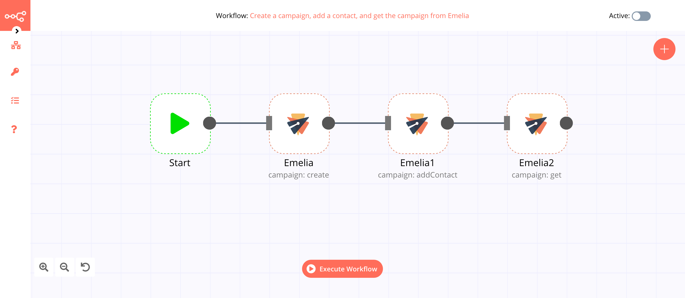
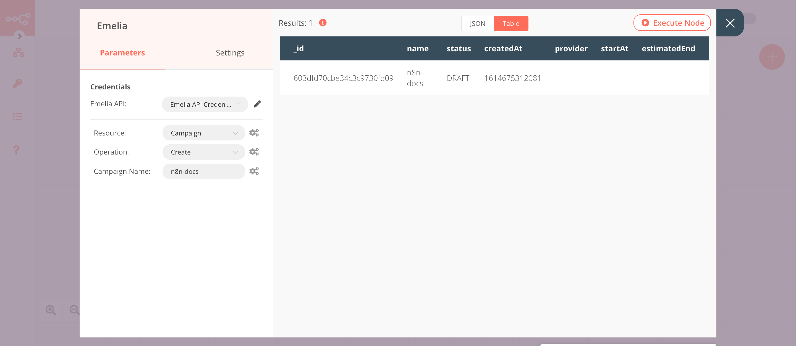

# Emelia

[Emelia](https://emelia.io) is a cold-mailing tool.

::: tip 🔑 Credentials
You can find authentication information for this node [here](../../../credentials/Emelia/README.md).
:::

## Basic Operations

::: details Campaign
- Add contact
- Create a campaign
- Get a campaign
- Get all campaigns
- Pause a campaign
- Start a campaign
:::

::: details Contact List
- Add a contact
- Get all contact lists
:::

## Example Usage

This workflow allows you to create a campaign, add a contact, and get the campaign from Emelia. You can also find the [workflow](https://n8n.io/workflows/961) on n8n.io. This example usage workflow uses the following nodes.
- [Start](../../core-nodes/Start/README.md)
- [Emelia]()

The final workflow should look like the following image.

### 1. Start node

The Start node exists by default when you create a new workflow.

### 2. Emelia node (campaign: create)

This node will create a new campaign in Emelia.

1. First of all, you'll have to enter credentials for the Emelia node. You can find out how to do that [here](../../../credentials/Emelia/README.md).
2. Select 'Create' from the ***Operation*** dropdown list.
3. Enter the campaign name in the ***Campaign Name*** field.
4. Click on ***Execute Node*** to run the node.

In the screenshot below, you will notice that the node creates a new campaign.

### 3. Emelia1 node (campaign: addContact)

This node will add a contact to the campaign that we created in the previous node.

1. Select the credentials that you entered in the previous node.
2. Select 'Add Contact' from the ***Operation*** dropdown list.
3. Select the campaign from the ***Campaign ID*** dropdown list.
4. Enter the contact's email address in the ***Contact Email*** field.
5. Click on the ***Add Field*** button and select 'First Name'.
6. Enter the first name in the ***First Name*** field.
7. Click on ***Execute Node*** to run the node.

In the screenshot below, you will notice that the node adds the contact to the campaign that we created in the previous node.

### 4. Emelia2 node (campaign: get)

This node will get the information about the campaign that we created earlier.
::: v-pre
1. Select the credentials that you entered in the previous node.
2. Select 'Get' from the ***Operation*** dropdown list.
3. Click on the gears icon next to the ***Campaign ID*** field and click on ***Add Expression***.
5. Select the following in the ***Variable Selector*** section: Nodes > Emelia > Output Data > JSON > _id. You can also add the following expression: `{{$node["Emelia"].json["_id"]}}`.
6. Click on ***Execute Node*** to run the node.
:::

In the screenshot below, you will notice that the node returns the information of the campaign.

