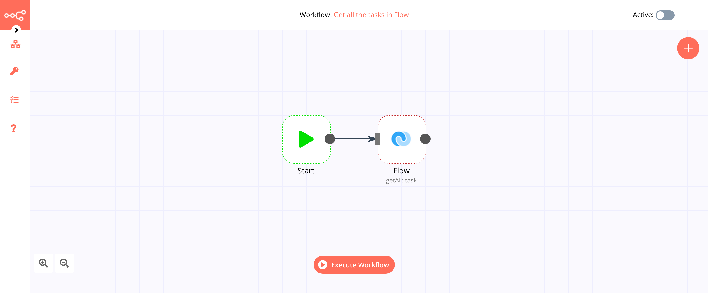

# Flow

[Flow](https://www.getflow.com/) is modern task and project management software for teams. It brings together tasks, projects, timelines, and conversations, and integrates with a lot of tools.

::: tip 🔑 Credentials
You can find authentication information for this node [here](../../../credentials/Flow/README.md).
:::

## Basic Operations

<Resource node="Flow" />

## Example Usage

This workflow allows you to get all the tasks in Flow. You can also find the [workflow](https://n8n.io/workflows/506) on the website. This example usage workflow would use the following two nodes.
- [Start](../../core-nodes/Start/README.md)
- [Flow]()

The final workflow should look like the following image.

### 1. Start node

The start node exists by default when you create a new workflow.

### 2. Flow node

1. First of all, you'll have to enter credentials for the Flow node. You can find out how to do that [here](../../../credentials/Flow/README.md).
2. Select the 'Get All' option from the *Operation* dropdown list.
3. Toggle the *Return All* slider to true.
4. Click on *Execute Node* to run the workflow.
