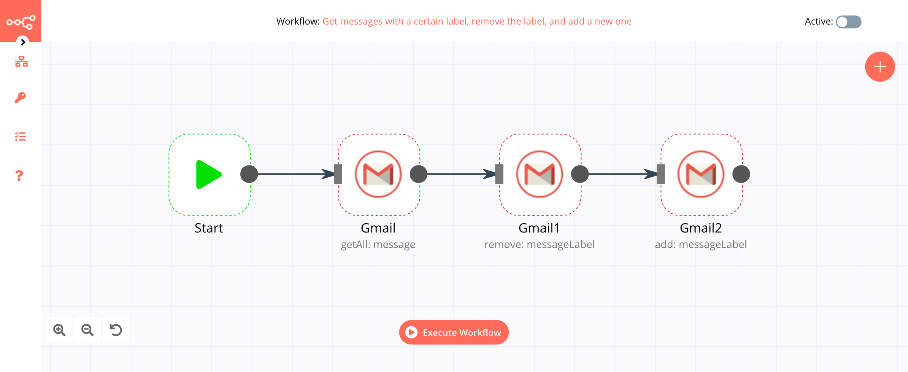
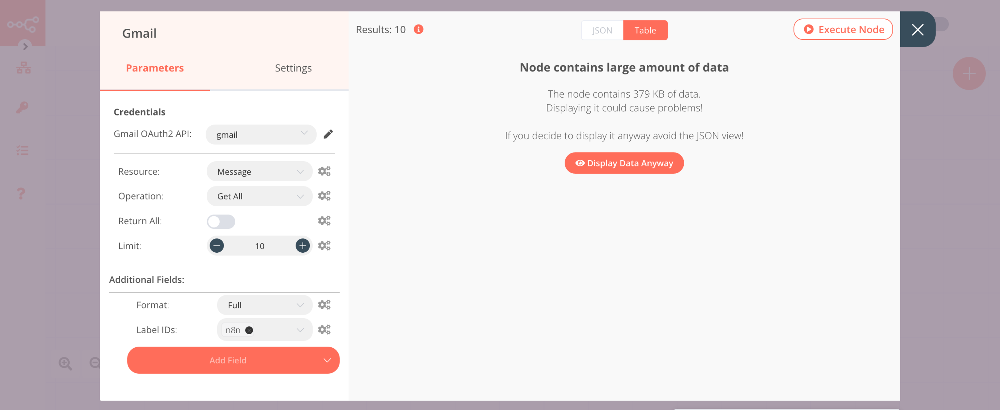
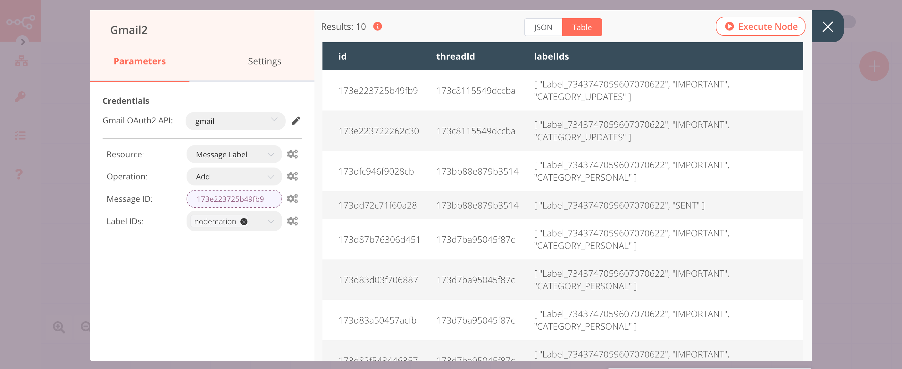

# Gmail

[Gmail](https://www.gmail.com) is an email service developed by Google.

::: tip 🔑 Credentials
You can find authentication information for this node [here](../../../credentials/Google/README.md).
:::

## Basic Operations

- Draft
    - Create a new email draft
    - Delete a draft
    - Get a draft
    - Get all drafts
- Label
    - Create a new label
    - Delete a label
    - Get a label
    - Get all labels
- Message
    - Send an email
    - Delete a message
    - Get a message
    - Get all messages
    - Reply to an email
- Message Label
    - Add a label to a message
    - Remove a label from a message

## Example Usage

This workflow allows you to get all messages with a certain label, remove the label from the messages and add a new label to the messages. You can also find the [workflow](https://n8n.io/workflows/621) on the website. This example usage workflow uses the following two nodes.
- [Start](../../core-nodes/Start/README.md)
- [Gmail]()

The final workflow should look like the following image.

### 1. Start node

The start node exists by default when you create a new workflow.

### 2. Gmail node (getAll: message)

1. First of all, you'll have to enter credentials for the Gmail node. You can find out how to do that [here](../../../credentials/Google/README.md).
2. Select 'Message' from the ***Resource*** dropdown list.
2. Select 'Get All' from the ***Operation*** dropdown list.
3. Click on ***Add Field*** button and select 'Format' from the dropdown list.
4. Select 'Full' from ***Format*** dropdown menu.
5. Click on ***Add Field*** button and select 'Label IDs' from the dropdown list.
6. Select the label from ***Label IDs*** dropdown list.
7. Click on ***Execute Node*** to run the node.

### 3. Gmail1 node (remove: messageLabel)

1. Select the credentials that you entered in the previous Gmail node.
2. Select 'Message Label' from the ***Resource*** dropdown list.
2. Select 'Remove' from the ***Operation*** dropdown list.
3. Open the ***Edit Expression Editor*** for ***Message ID***.
4. Under the ***Variable Selector*** section, select `Current Node > Input Data > JSON > id`.
5. Select the label from ***Label IDs*** dropdown list.
6. Click on ***Execute Node*** to run the node.

### 4. Gmail2 node (add: messageLabel)

1. Select the credentials that you entered in the previous Gmail node.
2. Select 'Message Label' from the ***Resource*** dropdown list.
2. Select 'Add' from the ***Operation*** dropdown list.
3. Open the ***Edit Expression Editor*** for ***Message ID***.
4. Under the ***Variable Selector*** section, select `Current Node > Input Data > JSON > id`.
5. Select the label from ***Label IDs*** dropdown list.
6. Click on ***Execute Node*** to run the node.

