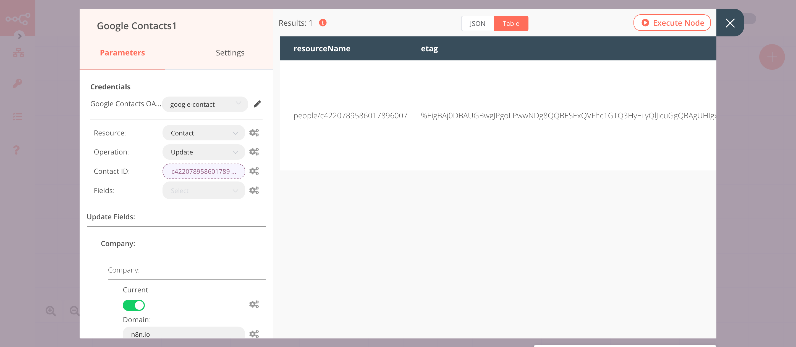

# Google Contacts

[Google Contacts](https://contacts.google.com/) is Google's contact management tool that is available in its free email service Gmail, as a standalone service, and as a part of Google's business-oriented suite of web apps Google Apps.

::: tip 🔑 Credentials
You can find authentication information for this node [here](../../../credentials/Google/README.md).
:::

## Basic Operations

<Resource node="n8n-nodes-base.googleContacts" />

## Example Usage

This workflow allows you to create, update, and get a contact from Google Contacts. You can also find the [workflow](https://n8n.io/workflows/637) on n8n.io. This example usage workflow would use the following nodes.
- [Start](../../core-nodes/Start/README.md)
- [Google Contacts]()

The final workflow should look like the following image.

### 1. Start node

The start node exists by default when you create a new workflow.

### 2. Google Contacts node (create: contact)

1. First of all, you'll have to enter credentials for the Google Contacts node. You can find out how to do that [here](../../../credentials/Google/README.md).
2. Enter the family name in the ***Family Name*** field.
3. Enter the given name in the ***Given Name*** field.
4. Click on ***Execute Node*** to run the node.

::: v-pre
### 3. Google Contacts1 node (update: contact)

1. Select the credentials that you entered in the previous node.
2. Select 'Update' from the ***Operation*** dropdown list.
3. Click on the gears icon next to the ***Contact ID*** field and click on ***Add Expression***.
4. Select the following in the ***Variable Selector*** section: Nodes > Google Contacts > Output Data > JSON > contactId. You can also add the following expression: `{{$node["Google Contacts"].json["contactId"]}}`.
5. Select `*` from the ***Fields*** dropdown list.
6. Click on the ***Add Field*** button and select ***Company***.
7. Click on the ***Add Company*** button.
8. Toggle the value to true for the ***Current*** field.
9. Enter the company's domain in the ***Domain*** field.
10. Enter the company's name in the ***Name*** field.
11. Enter the title in the ***Title*** field.
12. Click on ***Execute Node*** to run the node.
:::

::: v-pre
### 4. Google Contacts2 node (get: contact)

1. Select the credentials that you entered in the previous node.
2. Select 'Get' from the ***Operation*** dropdown list.
3. Click on the gears icon next to the ***Contact ID*** field and click on ***Add Expression***.
4. Select the following in the ***Variable Selector*** section: Nodes > Google Contacts > Output Data > JSON > contactId. You can also add the following expression: `{{$node["Google Contacts"].json["contactId"]}}`.
5. Select 'Organizations' from the ***Fields*** dropdown list.
6. Click on ***Execute Node*** to run the node.
:::

