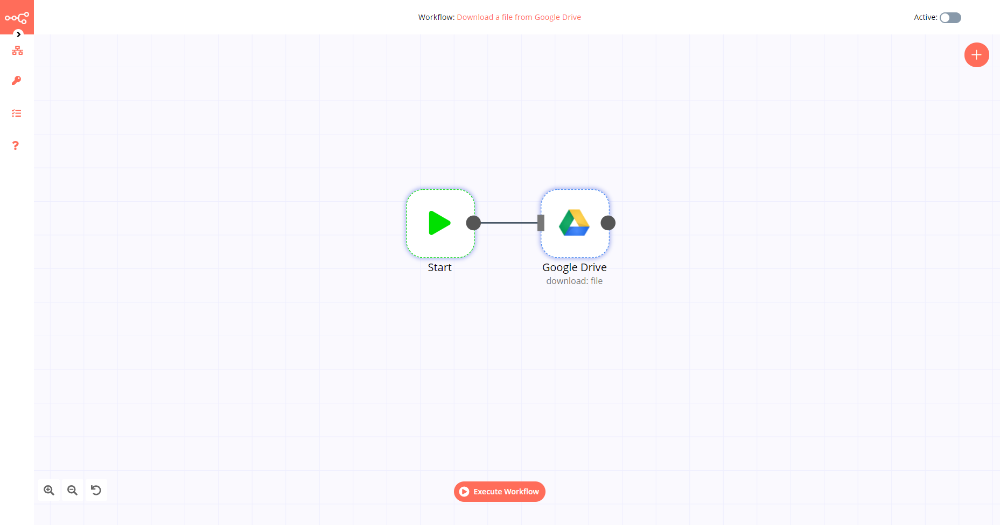

# Google Drive

[Google Drive](https://drive.google.com) is a file storage and synchronization service developed by Google. It allows users to store files on their servers, synchronize files across devices, and share files.

::: tip 🔑 Credentials
You can find authentication information for this node [here](../../../credentials/Google/README.md).
:::

## Basic Operations

::: details File
- Copy a file
- Delete a file
- Download a file
- List files and folders
- Upload a file
:::

::: details Folder
- Create a folder
- Delete a folder
:::

## Example Usage

This workflow allows you to download a file from Google Drive. You can also find the [workflow](https://n8n.io/workflows/515) on the website. This example usage workflow uses the following two nodes.
- [Start](../../core-nodes/Start/README.md)
- [Google Drive]()
- [Write Binary File](../../core-nodes/WriteBinaryFile/README.md)

The final workflow should look like the following image.

### 1. Start node

The Start node exists by default when you create a new workflow.

### 2. Google Sheets node

1. First of all, you'll have to enter credentials for the Google Drive node. You can find out how to do that [here](../../../credentials/Google/README.md), in the section 'Google Drive / Sheets API'.
2. Select the authentication method you plan to use from the *Authentication* dropdown list.
3. Select 'Download' from the *Operation* dropdown list.
4. Copy the string of characters located between `/d/` and `/edit` in your Google Drive URL. Paste that string in the *File ID* field.

### 3. Write Binary File node

1. Enter the destination file path in the *File Name* field.
2. Click on *Execute Node* to run the workflow.
