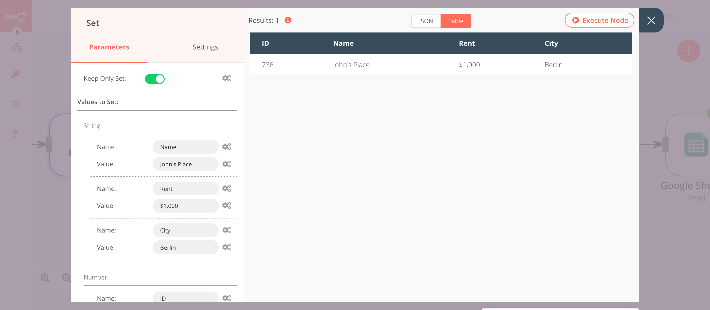
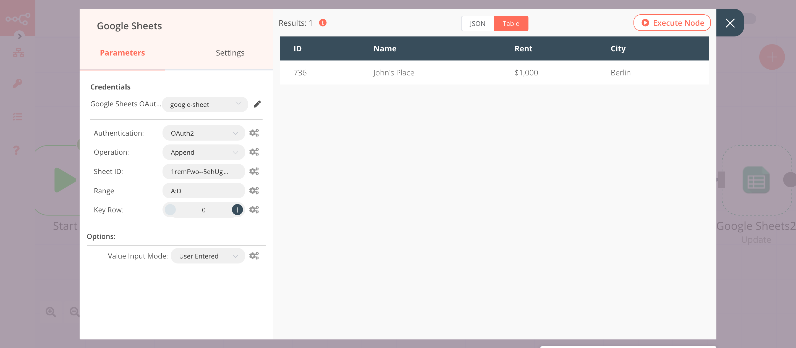
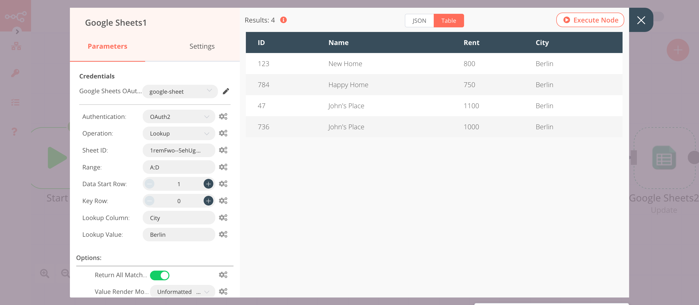

# Google Sheets

[Google Sheets](https://www.google.com/sheets) is a web-based spreadsheet program that is part of Google's office software  suite within its Google Drive service.

::: tip 🔑 Credentials
You can find authentication information for this node [here](../../../credentials/Google/README.md).
:::

## Basic Operations

- Append data to a sheet
- Clear data from a sheet
- Delete columns and rows from a sheet
- Look up a specific column value and return the matching row
- Read data from a sheet
- Update rows in a sheet

## Example Usage

This workflow shows you how to add to and read from a Google Sheets spreadsheet. You can also find the [workflow](https://n8n.io/workflows/600) on n8n.io. This example usage workflow uses the following nodes.
- [Start](../../core-nodes/Start/README.md)
- [Set](../../core-nodes/Set/README.md)
- [Google Sheets]()

The final workflow should look like the following image.

### 1. Start node

The Start node exists by default when you create a new workflow.

### 2. Set node

1. Click on the ***Add Value*** button and select 'Number' from the dropdown list.
2. Enter `id` in the ***Name*** field.
3. Click on the ***Add Value*** button and select 'String' from the dropdown list.
4. Enter `name` in the ***Name*** field.
5. Enter the value for the name in the ***Value*** field.
6. Click on ***Execute Node*** to run the node.

### 3. Google Sheets node (Append)

1. First of all, you'll have to enter credentials for the Google Sheets node. You can find out how to do that [here](../../../credentials/Google/README.md), in the section 'Google Drive / Sheets API'.
2. Select 'OAuth2' in the ***Authentication*** field.
3. Select 'Append' from the ***Operation*** dropdown list.
4. Copy the string of characters located between `/d/` and `/edit` in your spreadsheet URL. Paste that string in the ***Sheet ID*** field.
5. In the ***Range*** field, enter the range of columns to append the data to in your spreadsheet. Make sure that your range includes enough columns for all the data included in the Set node.
6. Enter `id` in the A1 cell and `name` in the B1 cell  of the spreadsheet.
7. Click on ***Execute Node*** to run the workflow.

### 4. Google Sheets1 node (Read)

1. Select the credentials that you entered in the previous Google Sheets node.
2. Select 'OAuth2' in the ***Authentication*** field.
3. Select 'Read' from the ***Operation*** dropdown list.
4. In the ***Sheet ID*** field, enter the same string used in the previous Google Sheets node.
5. In the ***Range*** field, enter the same range used in the previous Google Sheets node.
6. Click on ***Execute Node*** to run the workflow.

## FAQ

::: faq How to read the data in the format they were entered in Google Sheets?

By default, the unformatted values are read. For example, if your sheets have a column which contains dates (2020-09-24) the node will read them as numbers, perform the mathematical operation (subtraction for this example), and will give you the output (output for the example of the date: 1987).

If you want the formatted values, click on ***Add Option*** and select 'Formatted Value'. This will return the values as they are. For example, the dates will be returned in the format they were entered (2020-09-24).

If you want to return the formula used in the cells, click on ***Add Option*** and select 'Formula'.
:::

::: faq How to append an array in the Google Sheets?

To insert the data in Google Sheets, you have to first convert the data in a valid JSON (key, value) format. You can use the [Funtion node](../../core-nodes/Function/README.md) to convert the array into JSON format.
:::

::: faq How to return all the values with the Lookup operation?

By default, the Lookup operation returns only the first value that it matches. To return all the values that match, click on ***Add Option*** and select 'Return All Matches'. Toggle ***Return All Matches*** to true.
:::
