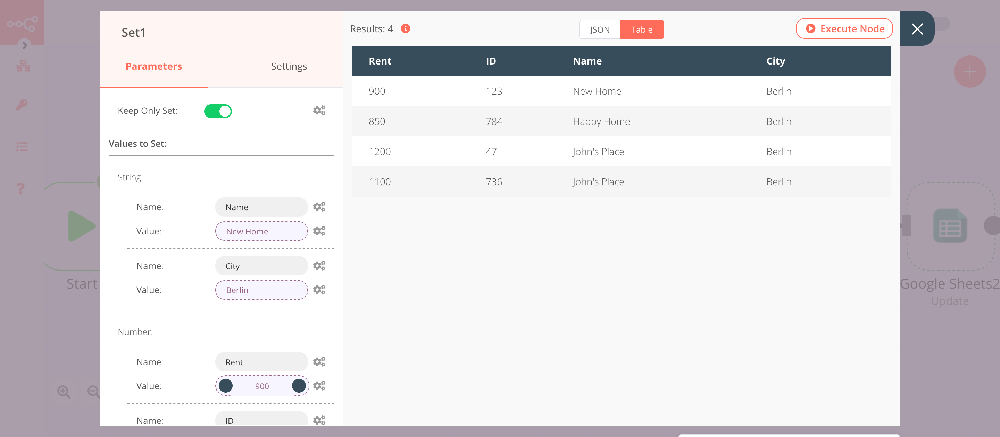
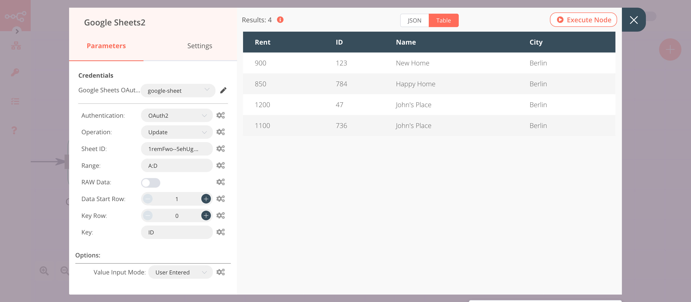
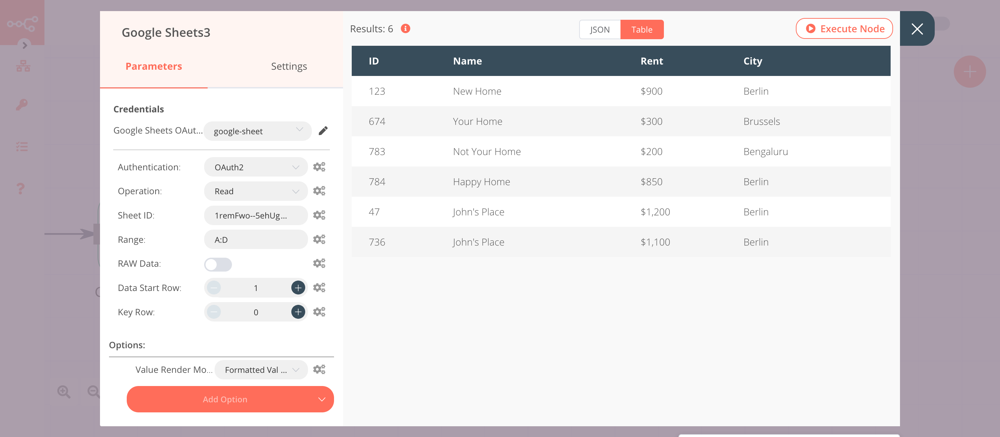

# Google Sheets

[Google Sheets](https://www.google.com/sheets) is a web-based spreadsheet program that is part of Google's office software  suite within its Google Drive service.

::: tip 🔑 Credentials
You can find authentication information for this node [here](../../../credentials/Google/README.md).
:::

## Basic Operations

- Append data to a sheet
- Clear data from a sheet
- Delete columns and rows from a sheet
- Look up a specific column value and return the matching row
- Read data from a sheet
- Update rows in a sheet

## Example Usage

This workflow allows you to append, lookup, update, and read data from a Google Sheets spreadsheet. You can also find the [workflow](https://n8n.io/workflows/694) on n8n.io. This example usage workflow uses the following nodes.
- [Start](../../core-nodes/Start/README.md)
- [Set](../../core-nodes/Set/README.md)
- [Google Sheets]()

The final workflow should look like the following image.

### 1. Start node

The Start node exists by default when you create a new workflow.

::: v-pre
### 2. Set node

The example workflow uses the Set node to generate data that we want to add to the Google Sheet. We can use other nodes, like [HTTP Request node](../../core-nodes/HTTPRequest/README.md), to get the data that we want to add to the Google Sheet.

1. Click on the ***Add Value*** button and select 'String' from the dropdown list.
2. Enter `Name` in the ***Name*** field.
3. Enter the name of the house in the ***Value*** field.
4. Click on the ***Add Value*** button and select 'String' from the dropdown list.
5. Enter `Rent` in the ***Name*** field.
6. Enter the rent of the house with the currency (example $1000) in the ***Value*** field.
7. Click on the ***Add Value*** button and select 'String' from the dropdown list.
8. Enter `City` in the ***Name*** field.
9. Enter the name of the city in the ***Value*** field.
10. Click on the ***Add Value*** button and select 'Number' from the dropdown list.
11. Enter `id` in the ***Name*** field.
12. Click on the gears icon next to the ***Value*** field click on ***Add Expression***.
13. Paste the following expression `{{Math.floor(Math.random()*1000)}}`. This expression will generate a three-digit random number.
14. Toggle ***Keep Only Set*** to true.
15. Click on ***Execute Node*** to run the node.
:::

  
### 3. Google Sheets node (Append)

This node will append the data in the Google Sheet.

1. First of all, you'll have to enter credentials for the Google Sheets node. You can find out how to do that [here](../../../credentials/Google/README.md), in the section 'Google Drive / Sheets API'.
2. Select 'OAuth2' in the ***Authentication*** field.
3. Select 'Append' from the ***Operation*** dropdown list.
4. Copy the string of characters located between `/d/` and `/edit` in your spreadsheet URL. Paste that string in the ***Sheet ID*** field.
5. In the ***Range*** field, enter the range of columns to append the data to, in your spreadsheet. Make sure that your range includes enough columns for all the data in the Set node. For this workflow, enter `A:D` in the ***Range*** field.
6. Click on the ***Add Option*** button and select 'Value Input Mode' from the dropdown list.
7. Select 'User Entered' from the ***Value Input Mode*** dropdown list.
8. In your spreadsheet, enter `ID`, `Name`, `Rent`, and `City` in the cells A1, B1, C1, and D1 respectively.
9. Click on ***Execute Node*** to run the workflow.

### 4. Google Sheets1 node (Lookup)

This node will return the entries that have `Berlin` as the city.

1. Select the credentials that you entered in the previous Google Sheets node.
2. Select 'OAuth2' in the ***Authentication*** field.
3. Select 'Lookup' from the ***Operation*** dropdown list.
4. In the ***Sheet ID*** field, enter the same string used in the previous Google Sheets node.
5. Enter `City` in the ***Lookup Column*** field.
6. Enter `Berlin` in the ***Lookup Value*** field.
7. Click on the ***Add Option*** button and select 'Return All Matches' from the dropdown list.
8. Toggle ***Return All Matches*** to true.
9. Click on the ***Add Option*** button and select 'Value Render Mode' from the dropdown list.
10. Click on ***Execute Node*** to run the workflow.

::: v-pre
### 5. Set1 node

This node will increase the rent by $100 for the houses in Berlin.

1. Click on the ***Add Value*** button and select 'String' from the dropdown list.
2. Enter `Name` in the ***Name*** field.
3. Click on the gears icon next to the ***Value*** field click on ***Add Expression***.
4. Select the following in the ***Variable Selector*** section: Nodes > Google Sheets1 > Output Data > JSON > Name. You can also add the following expression: `{{$node["Google Sheets1"].json["Name"]}}`.
5. Click on the ***Add Value*** button and select 'String' from the dropdown list.
6. Enter `City` in the ***Name*** field.
7. Click on the gears icon next to the ***Value*** field click on ***Add Expression***.
8. Select the following in the ***Variable Selector*** section: Nodes > Google Sheets1 > Output Data > JSON > City. You can also add the following expression: `{{$node["Google Sheets1"].json["City"]}}`.
9. Click on the ***Add Value*** button and select 'Number' from the dropdown list.
10. Click on the gears icon next to the ***Value*** field click on ***Add Expression***.
11. Paste the following expression: `{{$node["Google Sheets1"].json["Rent"]+100}}`. This expression will increment the rent by $100.
12. Click on the ***Add Value*** button and select 'Number' from the dropdown list.
13. Enter `id` in the ***Name*** field.
14. Click on the gears icon next to the ***Value*** field click on ***Add Expression***.
15. Select the following in the ***Variable Selector*** section: Nodes > Google Sheets1 > Output Data > JSON > ID. You can also add the following expression: `{{$node["Google Sheets1"].json["ID"]}}`.
16. Toggle ***Keep Only Set*** to true.
17. Click on ***Execute Node*** to run the node.
:::

### 6. Google Sheets2 node (Update)

This node will update the rent with the new rent set in the previous node.

1. Select the credentials that you entered in the previous Google Sheets node.
2. Select 'OAuth2' in the ***Authentication*** field.
3. Select 'Update' from the ***Operation*** dropdown list.
4. In the ***Sheet ID*** field, enter the same string used in the previous Google Sheets node.
5. In the ***Range*** field, enter the same range used in the previous Google Sheets node.
6. Enter `ID` in the ***Key*** field.
7. Click on the ***Add Option*** button and select 'Value Input Mode' from the dropdown list.
8. Select 'User Entered' from the ***Value Input Mode*** dropdown list.
9. Click on ***Execute Node*** to run the workflow.

### 7. Google Sheets3 node (Read)

This node will read the data from the Google Sheet.

1. Select the credentials that you entered in the previous Google Sheets node.
2. Select 'OAuth2' in the ***Authentication*** field.
3. Select 'Read' from the ***Operation*** dropdown list.
4. In the ***Sheet ID*** field, enter the same string used in the previous Google Sheets node.
5. In the ***Range*** field, enter the same range used in the previous Google Sheets node.
6. Click on the ***Add Option*** button and select 'Value Render Mode' from the dropdown list.
7. Select 'Formatted Value' from the ***Value Render Mode*** dropdown list.
8. Click on ***Execute Node*** to run the workflow.

## FAQ

### How to read the data in the format they were entered in Google Sheets?

By default, the unformatted values are read. For example, if your sheets have a column which contains dates (2020-09-24) the node will read them as numbers, perform the mathematical operation (subtraction for this example), and will give you the output (output for the example of the date: 1987).

If you want the formatted values, click on ***Add Option*** and select 'Formatted Value'. This will return the values as they are. For example, the dates will be returned in the format they were entered (2020-09-24).

If you want to return the formula used in the cells, click on ***Add Option*** and select 'Formula'.

### How to append an array in the Google Sheets?

To insert the data in Google Sheets, you have to first convert the data in a valid JSON (key, value) format. You can use the [Funtion node](../../core-nodes/Function/README.md) to convert the array into JSON format.
:::

### How to return all the values with the Lookup operation?

By default, the Lookup operation returns only the first value that it matches. To return all the values that match, click on ***Add Option*** and select 'Return All Matches'. Toggle ***Return All Matches*** to true.
