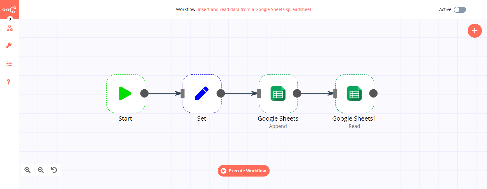

# Google Sheets

[Google Sheets](https://www.google.com/sheets) is a web-based spreadsheet program that is part of Google's office software  suite within its Google Drive service.

::: tip 🔑 Credentials
You can find authentication information for this node [here](../../../credentials/Google/README.md).
:::

## Basic Operations

- Append data to a sheet
- Clear data from a sheet
- Delete columns and rows from a sheet
- Look up a specific column value in a sheet
- Read data from a sheet
- Update rows in a sheet

## Example Usage

This workflow shows you how to read from from a Google Sheets spreadsheet. You can also find the [workflow](https://n8n.io/workflows/449) on this website. This example usage workflow uses the following two nodes.
- [Start](../../core-nodes/Start/README.md)
- [GoogleSheets]()

The final workflow should look like the following image.

### 1. Start node

The Start node exists by default when you create a new workflow.

### 2. Google Sheets node

1. First of all, you'll have to enter credentials for the Google Sheets node. You can find out how to do that [here](../../../credentials/Google/README.md), in the section 'Google Drive / Sheets API'.
2. Select *OAuth2* in the *Authentication* field.
3. Copy the string of characters located between `/d/` and `/edit` in your spreadsheet URL. Paste that string in the *Sheet ID* field.
4. In the *Range* field, enter the range of columns to be read from your spreadsheet.
5. In the *Data Start Row* field, enter the number of the first row that contains data, excluding the header row.
6. In the *Key Row* field, enter the number of the header row.
7. Click on *Execute Node* to run the workflow.

