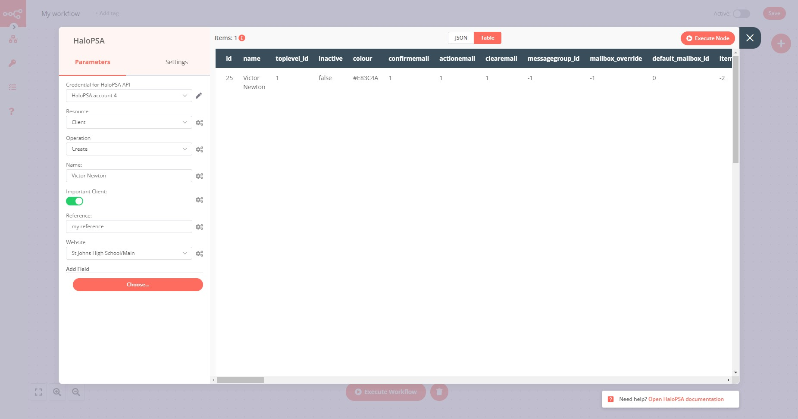

# HaloPSA

[HaloPSA](https://halopsa.com/) is a intuitive PSA software. Standardise your processes and keep your customers at the center of every conversation.

::: tip 🔑 Credentials
You can find authentication information for this node [here](../../../credentials/HaloPSA/README.md).
:::

## Basic Operations

<Resource node="n8n-nodes-base.haloPSA" />

## Example Usage

This workflow allows you to create a client in HaloPSA. This example workflow uses the following nodes.
- [Start](../../core-nodes/Start/README.md)
- [HaloPSA]()

### 1. Start node

The start node exists by default when you create a new workflow.

### 2. HaloPSA node (resource: client)

This node will create a new client in HaloPSA.

1. First of all, you'll have to enter credentials for the HaloPSA node. You can find out how to do that [here](../../../credentials/HaloPSA/README.md).
2. Select 'Client' in the ***Resource*** field.
3. Select 'Create' in the ***Operation*** field.
4. Enter the client name in the ***Name*** field.
5. Add additional fields such as ***VIP*** or ***Website*** by clicking ***Add Field***.

In the below screenshot you can see how the node creates a new client in HaloPSA.

