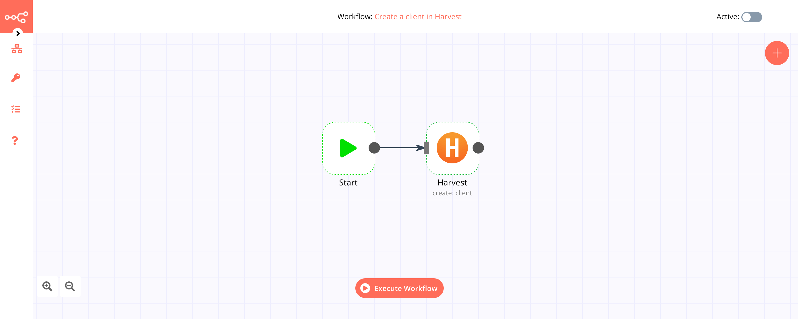

# Harvest

[Harvest](https://www.getharvest.com/) is a web-based time tracking tool that helps with its simple time tracking, fast online invoicing, and powerful reporting software.

::: tip 🔑 Credentials
You can find authentication information for this node [here](../../../credentials/Harvest/README.md).
:::

## Basic Operations

<Resource node="n8n-nodes-base.harvest" />

## Example Usage

This workflow allows you to create a client in Harvest. You can also find the [workflow](https://n8n.io/workflows/494) on the website. This example usage workflow would use the following two nodes.
- [Start](../../core-nodes/Start/README.md)
- [Harvest]()

The final workflow should look like the following image.

### 1. Start node

The start node exists by default when you create a new workflow.

### 2. Harvest node

1. First of all, you'll have to enter credentials for the Harvest node. You can find out how to do that [here](../../../credentials/Harvest/README.md).
2. Select the 'Client' option from the *Resource* dropdown list.
3. Select the 'Create' option from the *Operation* dropdown list.
4. Enter the name of the client in the *Name* field.
5. Click on *Execute Node* to run the workflow.
