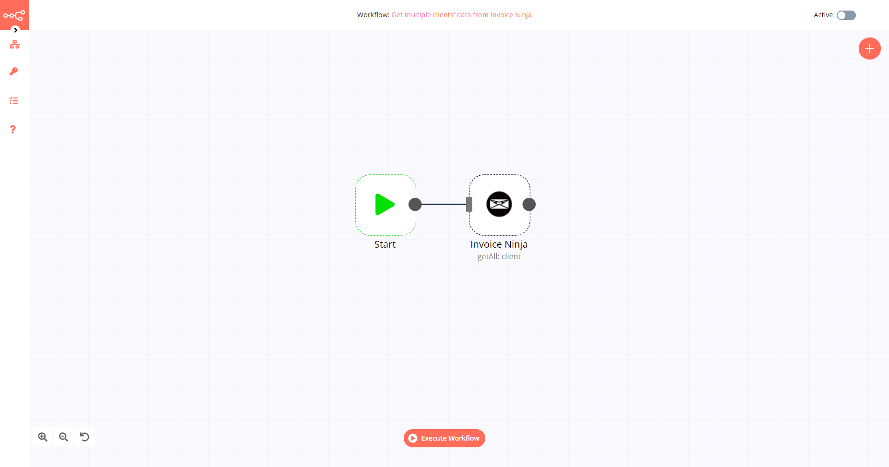

# Invoice Ninja

[Invoice Ninja](https://www.invoiceninja.com/) is a free open-source online invoicing app for freelancers & businesses. It offers invoicing, payments, expense tracking, & time-tasks.

::: tip 🔑 Credentials
You can find authentication information for this node [here](../../../credentials/InvoiceNinja/README.md).
:::

## Basic Operations

<Resource node="n8n-nodes-base.invoiceNinja" />

## Example Usage

This workflow allows you to get multiple clients' data from Invoice Ninja. You can also find the [workflow](https://n8n.io/workflows/534) on this website. This example usage workflow uses the following two nodes.

- [Start](../../core-nodes/Start/README.md)
- [Invoice Ninja]()

The final workflow should look like the following image.

### 1. Start node

The start node exists by default when you create a new workflow.

### 2. Invoice Ninja node

1. First of all, you'll have to enter credentials for the Invoice Ninja node. You can find out how to do that [here](../../../credentials/InvoiceNinja/README.md).
2. Select the 'Get All' option from the *Operation* dropdown list.
3. Click on *Execute Node* to run the workflow.
