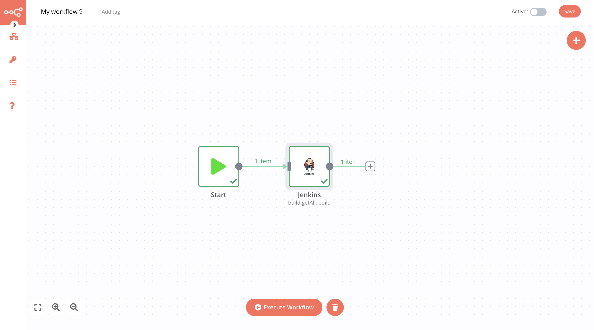

# Jenkins

[Jenkins](https://www.jenkins.io/) is an open source automation server that provides hundreds of plugins to support building, deploying and automating any project.

::: tip 🔑 Credentials
You can find authentication information for this node [here](../../../credentials/Jenkins/README.md).
:::

## Basic Operations

<Resource node="n8n-nodes-base.jenkins" />

## Example Usage

This workflow allows you to get list of builds in Jenkins. You can also find the [workflow](https://n8n.io/workflows/454) on the website. This example usage workflow would use the following two nodes.
- [Start](../../core-nodes/Start/README.md)
- [Jenkins]()

The final workflow should look like the following image.

### 1. Start node

The start node exists by default when you create a new workflow.

### 2. CircleCI node

1. First of all, you'll have to enter credentials for the Jenkins node. You can find out how to do that [here](../../../credentials/Jenkins/README.md).
2. Select the *Build*  from the dropdown in the *Resources* field.
3. *Get All Builds* is not selected in *Operations* dropdown.
4. Adjust the *depth* or add optional parameter by clickin *Add Field* button
5. Click on *Execute Node* to run the workflow.
