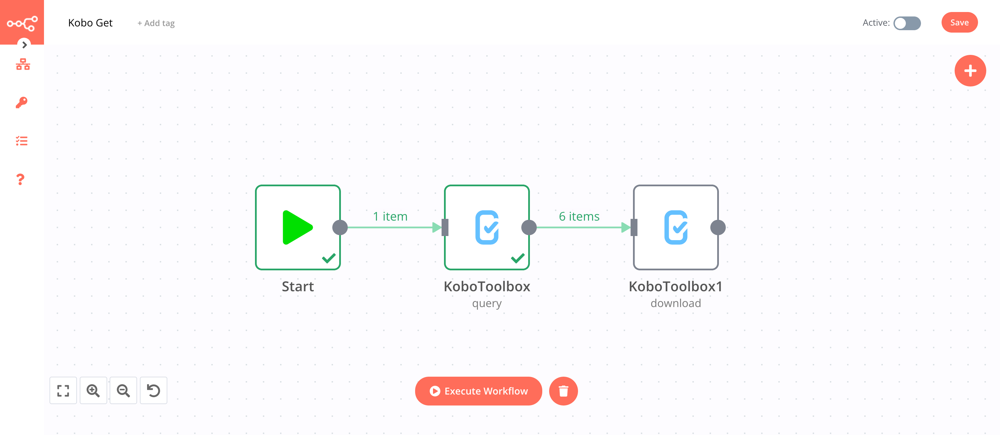
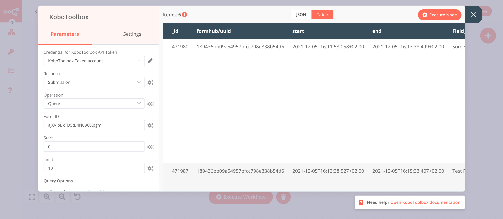
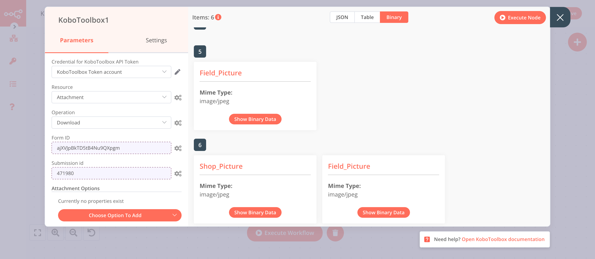

# KoboToolbox

[KoboToolbox](https://www.kobotoolbox.org/) is a field survey / data collection tool that makes it easy to design interactive forms to be filled offfline from mobile devices. It is available both as a free cloud solution or as a self-hosted version.

::: tip 🔑 Credentials
You can find authentication information for this node [here](../../../credentials/KoboToolbox/README.md).
:::

## Basic Operations

<Resource node="n8n-nodes-base.koboToolbox" />

## Example Usage

This workflow allows you to query some submissions for a particular form, and download associated binary attachments. It uses the following nodes:

- [Start](../../core-nodes/Start/README.md)
- [KoboToolbox]()

The final workflow should look like the following image.



### 1. Start node

The start node exists by default when you create a new workflow.

### 2. KoboToolbox node (submission: query)

This node will fetch form submissions for a given form ID.

1. First of all, you'll have to enter credentials for the KoboToolbox node. You can find out how to do that [here](../../../credentials/KoboToolbox/README.md).
1. Select 'Submission' from the ***Resource*** dropdown list.
1. Select 'Query' from the ***Operation*** dropdown list.
1. Provide a valid KoboToolbox form ID for your KoboToolbox instance in the ***Form ID*** field (get it from the URL of your form view in the KoboToolbox UI - e.g. a form at https://kf.kobotoolbox.org/#/forms/aJ6uJj8zhnQPij3myN4xRm/landing would have an id of `aJ6uJj8zhnQPij3myN4xRm`).
1. You may tweak the query options such as max returned records and search offset.
1. Click on ***Execute Node*** to run the node.

In the screenshot below, you will notice that the node outputs 10 submissions.



### 3. Kitemaker1 node (attachment: download)

This node will download any attachment related to each particular form submissions, such as pictures and videos.

1. Add a new KoboToolbox node.
1. Select the credentials that you entered in the previous KoboToolbox node.
1. Select 'Attachment' from the ***Resource*** dropdown list.
1. Select 'Download' from the ***Operation*** dropdown list.
1. Next to the ***Form ID*** field, click on the gears icon, select ***Add Expression***, and enter the expression `{{$json["_xform_id_string"]}}` to reference the form ID from each submission record, or select the following in the ***Variable Selector***: Current Node > Input Data > JSON > `_xform_id_string`
1. Next to the ***Submission ID*** field, click on the gears icon, select ***Add Expression***, and enter the expression `{{$json["_id"]}}` to reference the submission ID from each submission record, or select the following in the ***Variable Selector***: Current Node > Input Data > JSON > `_id`
1. Click on ***Execute Node*** to run the node.

In the screenshot below, you can see some sample binary downloads (possibly more than one per submission).



## More details

### Query Options

The Query Submission operation supports a few query options:

- In the main section of the ***Parameters*** panel, the ***Start*** and ***Limit*** will control the index offset to start the query from (to use the API pagination logic), and the max number of records to return. Note that the API always has a limit of 30,000 returned records, whatver the value you provide.
- In the ***Query Options*** section, you may activate the following parameters:
  - The ***Query*** option will let you specify various filter predicates, in MongoDB's JSON query format. For example: `{"status": "success", "_submission_time": {"$lt": "2021-11-01T01:02:03"}}` will query for all submissions with the value `success` for the field `status`, and submitted before November 1st, 2021, 01:02:03. If not specified, all submissions will be returned.
  - The ***Fields*** option will let you specifiy the list of fields you want to fetch, to make the response lighter. If not specified, all fields will be returned.
  - The ***Sort*** option will let you provide a list of sorting criteria, in MongoDB JSON format. For example, `{"status": 1, "_submission_time": -1}` will specifiy a sort order by ascending status, and then descending submission time.
  - More details about these options can be found in the [Formhub API docs](https://github.com/SEL-Columbia/formhub/wiki/Formhub-Access-Points-(API)#api-parameters)

### Reformatting options

The default JSON format for KoboToolbox submission data is sometimes hard to deal with, because it is not schema-aware, and all fields are therefore returned as strings.

This node provides a lightweight opinionated reformatting logic, enabled with the ***Reformat?*** parameter, available on all operations that return form submissions, i.e. the submission query, get, and the attachment download operations.

When enabled, the reformatting will:

- Reorganize the JSON into a multi-level hierarchy following the form's groups. By default, question grouping hierarchy is materialized by a `/` character in the field names, e.g. `Group1/Question1`. With reformatting enabled, these will be rerganized into `Group1.Question1`, as nested JSON objects.
- Rename fields to trim `_` (not supported by many downstream systems)
- Parse all geospatial fields (Point, Line, and Area question types) into their standard GeoJSON equivalent
- Split all fields matching any of the the ***Multiselect Mask*** wildcard masks into an array. Since the multi-select fields appear as space-separated strings, they cannot be guessed algorithmically, so a field naming mask needs to be provided. The masks are provided as a comma-separated list supporting the `*` wildcard.
- Convert all fields matching any of the ***Number Mask*** wildcard masks into a JSON float.

Consider for instance the following form submission:

```json
{
  "_id": 471987,
  "formhub/uuid": "189436bb09a54957bfcc798e338b54d6",
  "start": "2021-12-05T16:13:38.527+02:00",
  "end": "2021-12-05T16:15:33.407+02:00",
  "Field_Details/Field_Name": "Test Fields",
  "Field_Details/Field_Location": "-1.932914 30.078211 1421 165",
  "Field_Details/Field_Shape": "-1.932914 30.078211 1421 165;-1.933011 30.078085 0 0;-1.933257 30.078004 0 0;-1.933338 30.078197 0 0;-1.933107 30.078299 0 0;-1.932914 30.078211 1421 165",
  "Field_Details/Crops_Grown": "maize beans avocado",
  "Field_Details/Field_Size_sqm": "2300",
  "__version__": "veGcULpqP6JNFKRJbbMvMs",
  "meta/instanceID": "uuid:2356cbbe-c1fd-414d-85c8-84f33e92618a",
  "_xform_id_string": "ajXVJpBkTD5tB4Nu9QXpgm",
  "_uuid": "2356cbbe-c1fd-414d-85c8-84f33e92618a",
  "_attachments": [],
  "_status": "submitted_via_web",
  "_geolocation": [
    -1.932914,
    30.078211
  ],
  "_submission_time": "2021-12-05T14:15:44",
  "_tags": [],
  "_notes": [],
  "_validation_status": {},
  "_submitted_by": null
}
```

With reformatting enabled, and the appropriate masks for multi-select and number formatting (e.g. `Crops_*` and `*_sqm` respecitvely), it will be parsed into:

```json
{
  "id": 471987,
  "formhub": {
    "uuid": "189436bb09a54957bfcc798e338b54d6"
  },
  "start": "2021-12-05T16:13:38.527+02:00",
  "end": "2021-12-05T16:15:33.407+02:00",
  "Field_Details": {
    "Field_Name": "Test Fields",
    "Field_Location": {
      "lat": -1.932914,
      "lon": 30.078211
    },
    "Field_Shape": {
      "type": "polygon",
      "coordinates": [
        {
          "lat": -1.932914,
          "lon": 30.078211
        },
        {
          "lat": -1.933011,
          "lon": 30.078085
        },
        {
          "lat": -1.933257,
          "lon": 30.078004
        },
        {
          "lat": -1.933338,
          "lon": 30.078197
        },
        {
          "lat": -1.933107,
          "lon": 30.078299
        },
        {
          "lat": -1.932914,
          "lon": 30.078211
        }
      ]
    },
    "Crops_Grown": [
      "maize",
      "beans",
      "avocado"
    ],
    "Field_Size_sqm": 2300
  },
  "version": "veGcULpqP6JNFKRJbbMvMs",
  "meta": {
    "instanceID": "uuid:2356cbbe-c1fd-414d-85c8-84f33e92618a"
  },
  "xform_id_string": "ajXVJpBkTD5tB4Nu9QXpgm",
  "uuid": "2356cbbe-c1fd-414d-85c8-84f33e92618a",
  "attachments": [],
  "status": "submitted_via_web",
  "geolocation": {
    "lat": -1.932914,
    "lon": 30.078211
  },
  "submission_time": "2021-12-05T14:15:44",
  "tags": [],
  "notes": [],
  "validation_status": {},
  "submitted_by": null
}
```
