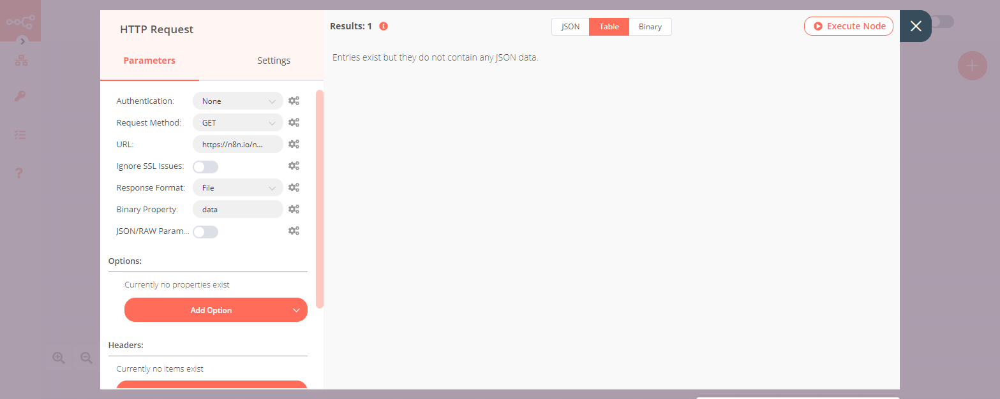

# LinkedIn

[LinkedIn](https://www.linkedin.com/) is an employment-oriented online service. It is mainly used for professional networking, including employers posting jobs and job seekers posting their CVs.

::: tip 🔑 Credentials
You can find authentication information for this node [here](../../../credentials/LinkedIn/README.md).
:::

## Basic Operations

<Resource node="n8n-nodes-base.linkedIn" />

## Example Usage

This workflow allows you to get an image from a URL and post it on LinkedIn. You can also find the [workflow](https://n8n.io/workflows/681) on n8n.io. This example usage workflow would use the following nodes.
- [Start](../../core-nodes/Start/README.md)
- [HTTP Request](../../core-nodes/HTTPRequest/README.md)
- [LinkedIn]()

The final workflow should look like the following image.

### 1. Start node

The start node exists by default when you create a new workflow.

### 2. HTTP Request node

1. Enter the URL of the image you want to download in the ***URL*** field.
2. Select ***File*** from the ***Response Format*** dropdown list.
3. Click on ***Execute Node*** to run the node.

### 3. LinkedIn node

1. First of all, you'll have to enter credentials for the LinkedIn node. You can find out how to do that [here](../../../credentials/LinkedIn/README.md).
2. Select 'Person' from the ***Post As*** dropdown list.
3. Select the person you want to post as from the ***Person*** dropdown list.
4. Enter a message in the ***Text*** field.
5. Select 'Image' from the ***Media Category*** dropdown list.
6. Click on ***Execute Node*** to run the node.

## Further Reading

<FurtherReadingBlog />
