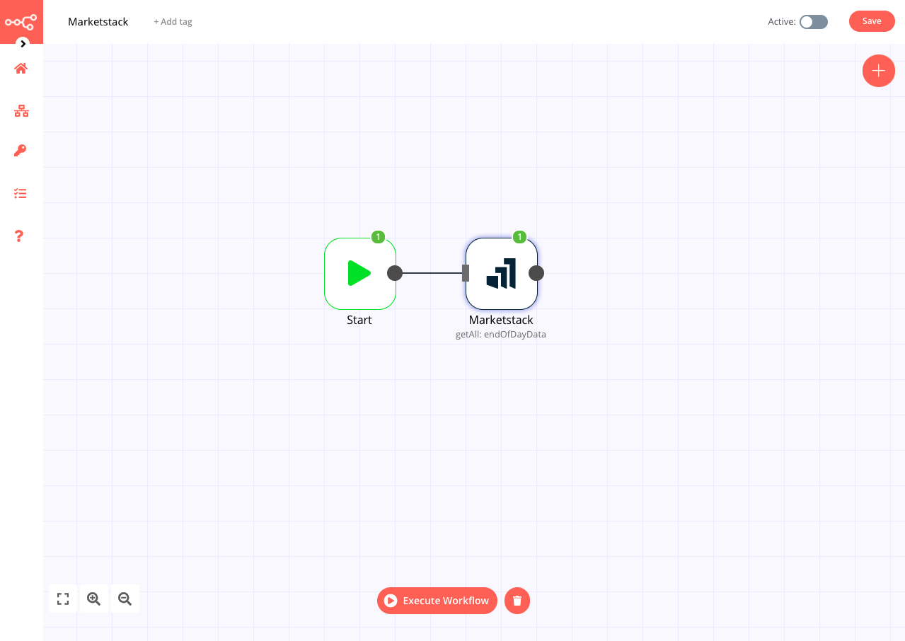

# Marketstack

[Marketstack](https://marketstack.com) is one of the most widely used REST APIs for stock market data.

::: tip 🔑 Credentials
You can find authentication information for this node [here](../../../credentials/Marketstack/README.md).
:::

## Basic Operations

<Resource node="n8n-nodes-base.marketstack" />

## Example Usage

This workflow allows you to receive the latest End-of-day data for a stock. This example usage workflow would use the following two nodes.
- [Start](../../core-nodes/Start/README.md)
- [Marketstack]()

The workflow should look like the following image.

### 1. Start node

The start node exists by default when you create a new workflow.

### 2. Marketstack node

1. First of all, you'll have to enter credentials for the Marketstack node. You can find out how to do that [here](../../../credentials/Marketstack/README.md).
2. Enter the stock's symbol in the *Stock* field. You can find stock symbols on Marketshare's [Stock Search](https://marketstack.com/search) page.
3. Click on *Execute Node* to run the workflow.
