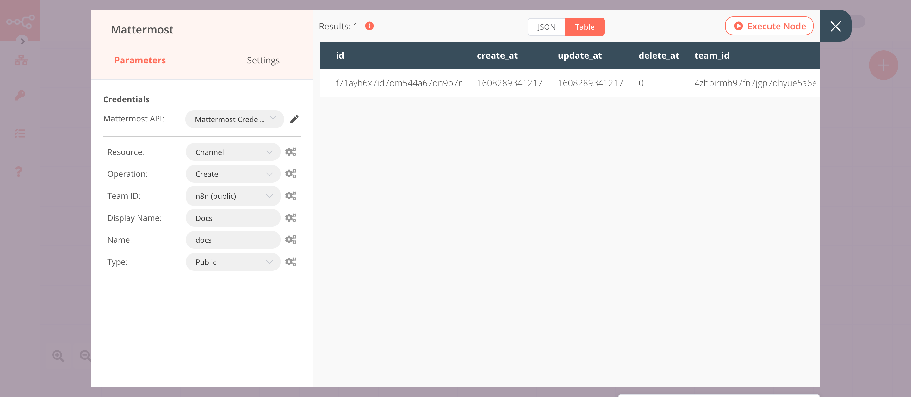

# Mattermost

[Mattermost](https://mattermost.org/) is an open-source, self-hostable online chat service with file sharing, search, and integrations. It is designed as an internal chat for organisations and companies.

::: tip 🔑 Credentials
You can find authentication information for this node [here](../../../credentials/Mattermost/README.md).
:::

## Basic Operations

::: details Channel
- Add a user to a channel
- Create a new channel
- Soft delete a channel
- Get a page of members for a channel
- Restores a soft deleted channel
- Get statistics for a channel
:::

::: details Message
- Soft delete a post, by marking the post as deleted in the database
- Post a message into a channel
:::

::: details User
- Create a new user
- Deactivates the user and revokes all its sessions by archiving its user object
- Retrieve all users
- Get a user by email
- Get a user by id
- Invite a user to a team
:::

## Example Usage

This workflow allows you to create a channel, add a member, and post a message to the channel on Mattermost. You can also find the [workflow](https://n8n.io/workflows/832) on n8n.io. This example usage workflow uses the following nodes.
- [Start](../../core-nodes/Start/README.md)
- [Mattermost]()

The final workflow should look like the following image.

### 1. Start node

The start node exists by default when you create a new workflow.

### 2. Mattermost node (create: channel)

This node will create a new channel named `docs` in Mattermost. If you want to create a channel with a different name, enter that name instead.

1. First of all, you'll have to enter credentials for the Mattermost node. You can find out how to do that [here](../../../credentials/Mattermost/README.md).
2. Select 'Channel' from the ***Resource*** dropdown list.
3. Select a team from the ***Team ID*** dropdown list.
4. Enter `Docs` in the ***Display Name*** field.
5. Enter `docs` in the ***Name*** field.
6. Click on ***Execute Node*** to run the node.

In the screenshot below, you will notice that the node creates a new channel named `docs` in Mattermost.

### 3. Mattermost1 node (addUser: channel)

This node will add a member to the channel that we created in the previous node.
::: v-pre
1. Select the credentials that you entered in the previous node.
2. Select 'Channel' from the ***Resource*** dropdown list.
3. Select 'Add User' from the ***Operation*** dropdown list.
4. Click on the gears icon next to the ***Channel ID*** field and click on ***Add Expression***.
5. Select the following in the ***Variable Selector*** section: Nodes > Mattermost > Output Data > JSON > id. You can also add the following expression: `{{$node["Mattermost"].json["id"]}}`.
6. Select a user from the ***User ID*** dropdown list.
7. Click on ***Execute Node*** to run the node.
:::
In the screenshot below, you will notice that the node adds a user to the channel that we created in the previous node.

### 4. Mattermost2 node (post: message)

This node will post a message to the channel that we created using the Mattermost node.
::: v-pre
1. Select the credentials that you entered in the previous node.
2. Click on the gears icon next to the ***Channel ID*** field and click on ***Add Expression***.
3. Select the following in the ***Variable Selector*** section: Nodes > Mattermost > Output Data > JSON > id. You can also add the following expression: `{{$node["Mattermost"].json["id"]}}`.
4. Enter a message in the ***Message*** field.
5. Click on ***Execute Node*** to run the node.
:::
In the screenshot below, you will notice that the node posts a message to the channel that we created in the Mattermost node.

## FAQs

### How do I resolve the error for the ***Channel ID*** field?

If you're not the System Administrator, you might get an error `there was a problem loading the parameter options from server: "Mattermost error response: You do not have the appropriate permissions."` next to the ***Channel ID*** field.

If the system administrator has granted you the `post:channel` permissions, you will be able to execute the node successfully even with the error.

### How do I find the Channel ID?

To find the Channel ID in Mattermost, follow the steps mentioned below.

1. Select the channel from the left sidebar.
2. Click on the channel name on the top and select 'View Info' from the dropdown list.
3. Use the displayed ***ID*** in n8n.

## Further Reading

- [Creating Custom Incident Response Workflows with n8n 🚨](https://medium.com/n8n-io/creating-custom-incident-response-workflows-with-n8n-9baef0bbedb9)
- [Creating Error Workflows in n8n 🌪](https://medium.com/n8n-io/creating-error-workflows-in-n8n-6e03c9ecbc0f)
- [Effortless video collaboration with Whereby, Mattermost, and n8n 📹](https://medium.com/n8n-io/effortless-video-collaboration-with-whereby-mattermost-and-n8n-8fc397feb9cb)
- [Giving kudos to contributors with GitHub, Slack, and n8n 👏](https://medium.com/n8n-io/giving-kudos-to-contributors-with-github-slack-and-n8n-b3f5f4a653a6)
- [Supercharging your conference registration process with n8n 🎫](https://medium.com/n8n-io/supercharging-your-conference-registration-process-with-n8n-2831cdff37f9)
- [Webhooks Fun with n8n and Mattermost 🍸](https://medium.com/n8n-io/webhooks-fun-with-n8n-and-mattermost-4ebf7e2b4d2a)
