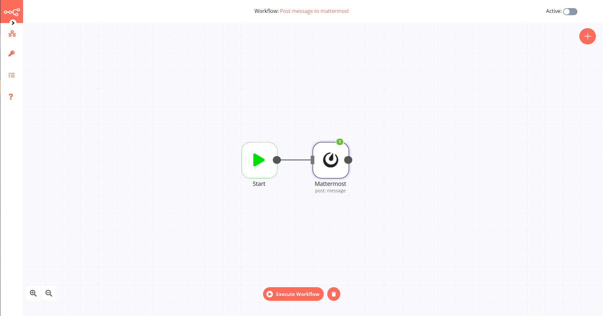

# Mattermost

[Mattermost](https://mattermost.org/) is an open-source, self-hostable online chat service with file sharing, search, and integrations. It is designed as an internal chat for organisations and companies.

::: tip 🔑 Credentials
You can find authentication information for this node [here](../../../credentials/Mattermost/README.md).
:::

## Basic Operations

- Channel
    - Add a user to a channel
    - Create a new channel
    - Soft delete a channel
    - Get a page of members for a channel
    - Restores a soft deleted channel
    - Get statistics for a channel
- Message
	- Soft delete a post, by marking the post as deleted in the database
	- Post a message into a channel
- User
	- Deactivates the user and revokes all its sessions by archiving its user object
	- Retrieve all users
	- Get a user by email
	- Get a user by id	

## Example Usage

This workflow allows you to post to a channel on Mattermost. You can also find the [workflow](https://n8n.io/workflows/447) on the website. This example usage workflow would use the following two nodes.
- [Start](../../core-nodes/Start/README.md)
- [Mattermost]()

The final workflow should look like the following image.

### 1. Start node

The start node exists by default when you create a new workflow.

### 2. Mattermost node

1. First of all, you'll have to enter credentials for the Mattermost node. You can find out how to do that [here](../../../credentials/Mattermost/README.md).
2. Select the channel you would like to post to in the *Channel ID* dropdown.
3. Type the message you want to post in the *Message* field.
4. Click on *Execute Node* to run the workflow.

## Further Reading

- [Creating Custom Incident Response Workflows with n8n 🚨](https://medium.com/n8n-io/creating-custom-incident-response-workflows-with-n8n-9baef0bbedb9)
- [Creating Error Workflows in n8n 🌪](https://medium.com/n8n-io/creating-error-workflows-in-n8n-6e03c9ecbc0f)
- [Webhooks Fun with n8n and Mattermost 🍸](https://medium.com/n8n-io/webhooks-fun-with-n8n-and-mattermost-4ebf7e2b4d2a)
