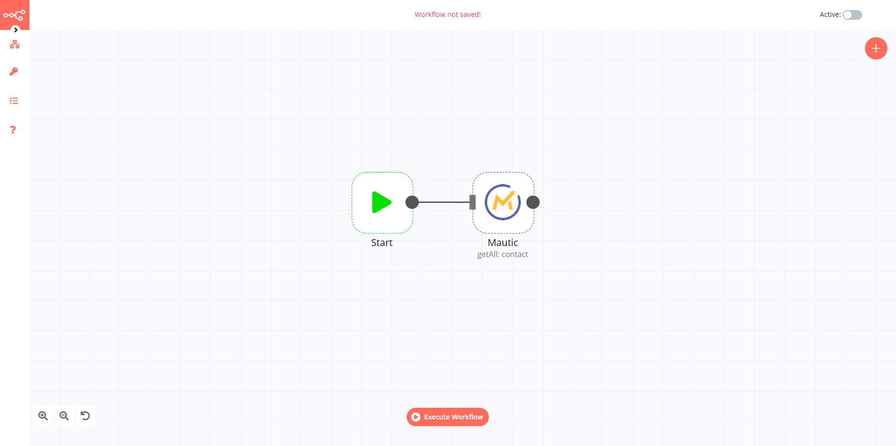

# Mautic

[Mautic](https://www.mautic.org/) is an open-source marketing automation software that helps online businesses automate their repetitive marketing tasks such as lead generation, contact scoring, contact segmentation, and marketing campaigns.

::: tip 🔑 Credentials
You can find authentication information for this node [here](../../../credentials/Mautic/README.md).
:::

## Basic Operations

<Resource node="n8n-nodes-base.mautic" />

## Example Usage

This workflow allows you to get all contacts from Mautic. You can also find the [workflow](https://n8n.io/workflows/549) on the website. This example usage workflow uses the following two nodes.

- [Start](../../core-nodes/Start/README.md)
- [Mautic]()

The final workflow should look like the following image.

### 1. Start node

The start node exists by default when you create a new workflow.

### 2. Mautic node

1. First of all, you'll have to enter credentials for the Mautic node. You can find out how to do that [here](../../../credentials/Mautic/README.md).
2. Select 'Get All' from the *Operation* dropdown list.
3. Click on *Execute Node* to run the workflow.
