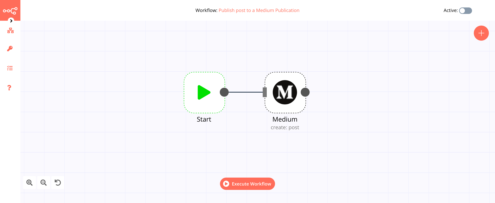

# Medium

[Medium](https://www.medium.com/) is an online publishing platform and home to a diverse array of stories, ideas, and perspectives. It empowers writers to share their work and ideas with the readers.

::: tip 🔑 Credentials
You can find authentication information for this node [here](../../../credentials/Medium/README.md).
:::

## Basic Operations

- Post
	- Create a post
- Publication
	- Get all publications

## Example Usage

This workflow allows you to post an article to a publications on Medium. You can also find the [workflow](https://n8n.io/workflows/594) on the website. This example usage workflow uses the following two nodes.

- [Start](../../core-nodes/Start/README.md)
- [Medium]()

The final workflow should look like the following image.

### 1. Start node

The start node exists by default when you create a new workflow.

### 2. Medium node

1. First of all, you'll have to enter credentials for the Medium node. You can find out how to do that [here](../../../credentials/Medium/README.md).
2. Select the publication from the ***Publication ID*** dropdown list.
3. Enter the title in the ***Title*** field.
4. Select format from the ***Content Format*** dropdown list.
6. Enter the post content in the ***Content*** field.
5. Click on ***Execute Node*** to run the workflow.
