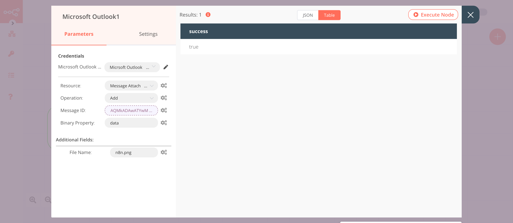

# Microsoft Outlook

[Microsoft Outlook](https://outlook.live.com/) is a personal information manager software system from Microsoft. Microsoft Outlook is an email client that includes calendaring, task managing, contact managing, note-taking, journal logging, and web browsing.

::: tip 🔑 Credentials
You can find authentication information for this node [here](../../../credentials/Microsoft/README.md).
:::

## Basic Operations

::: details Draft
- Create a new email draft
- Delete a draft
- Get a draft
- Send an existing draft message
- Update a draft
:::

::: details Folder
- Create a new mail folder in the root folder of the user's mailbox
- Delete a folder
- Get a folder
- Get all folders under the root folder of the signed-in user
- List all child folders under a folder
:::

::: details Folder Message
- Get all the messages in a folder
:::

::: details Message
- Delete a message
- Get a message
- Get all messages from the signed-in user's mailbox
- Get MIME content of a message
- Create a reply to a message
- Send a message
- Update a message
:::

::: details Message Attachment
- Add an attachment to a message
- Download attachment content
- Get an attachment from a message
- Get all the message's attachments
:::

## Example Usage

This workflow allows you to create, add an attachment, and send a draft using the Microsoft Outlook node. You can also find the [workflow](https://n8n.io/workflows/867) on n8n.io. This example usage workflow uses the following nodes.
- [Start](../../core-nodes/Start/README.md)
- [Microsoft Outlook]()
- [HTTP Request](../../core-nodes/HTTPRequest/README.md)

The final workflow should look like the following image.


### 1. Start node

The start node exists by default when you create a new workflow.

### 2. Microsoft Outlook node (create: draft)

This node will create a draft message that we will send using the Microsoft Outlook node later in the workflow.

1. First of all, you'll have to enter credentials for the Microsoft Outlook node. You can find out how to do that [here](../../../credentials/Microsoft/README.md).
2. Select 'Draft' from the ***Resource*** dropdown list.
3. Enter the subject in the ***Subject*** field.
4. Enter the following content in the ***Body Content*** field.
```html
<h1>Hello from n8n!</h1>
<p>We are sending this email using the Microsoft Outlook node in <a href="https://n8n.io">n8n</a></p>
<p>Best,</p>
<p>Sender</p>
```
5. Click on ***Add Field*** and select 'Body Content Type' from the dropdown list.
6. Click on ***Execute Node*** to run the node.

In the screenshot below, you will notice that the node creates a new draft with the subject `Hello from n8n!` and HTML body content.


### 3. HTTP Request node (GET)

This node will fetch the logo of n8n from a URL. We will attach this file to our draft message that we created earlier. If you want to attach a different file, enter the URL of that file instead.

1. Enter `https://n8n.io/n8n-logo.png` in the ***URL*** field.
2. Select 'File' from the ***Response Format*** dropdown list.
3. Click on ***Execute Node*** to run the node.

In the screenshot below, you will notice that the node returns the n8n logo. We will attach this file to the draft message that we created using the previous node.


### 4. Microsoft Outlook1 node (add: messageAttachment)

This node will attach the file that we received from the previous node to the drat message we created using the Microsoft Outlook node.
::: v-pre
1. Select the credentials that you entered in the previous Microsoft Outlook node.
2. Select 'Message Attachment' from the ***Resource*** dropdown list.
3. Click on the gears icon next to the ***Message ID*** field and click on ***Add Expression***.
4. Select the following in the ***Variable Selector*** section: Nodes > Microsoft Outlook > Output Data > JSON > id. You can also add the following expression: `{{$node["Microsoft Outlook"].json["id"]}}`.
5. Click on the ***Add Field*** button.
6. Enter `n8n.png` in the ***File Name*** field.
7. Click on ***Execute Node*** to run the node.
:::
In the screenshot below, you will notice that the node attaches the file to the draft message that we created using the Microsoft Outlook node.



### 5. Microsoft Outlook2 node (send: draft)

This node will send the draft message that we created using the Microsoft Outlook node to a recipient.
::: v-pre
1. Select the credentials that you entered in the previous node.
2. Select 'Draft' from the ***Resource*** dropdown list.
3. Select 'Send' from the ***Operation*** dropdown list.
4. Click on the gears icon next to the ***Message ID*** field and click on ***Add Expression***.
5. Select the following in the ***Variable Selector*** section: Nodes > Microsoft Outlook > Output Data > JSON > id. You can also add the following expression: `{{$node["Microsoft Outlook"].json["id"]}}`.
6. Click on the ***Add Field*** button.
7. Enter the recipient's email address in the ***Recipients*** field.
8. Click on ***Execute Node*** to run the node.
:::
In the screenshot below, you will notice that the node sends the draft message that we created using the Microsoft Outlook node to a recipient.


