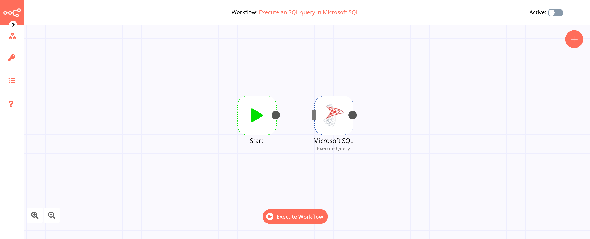

# Microsoft SQL

[Microsoft SQL](https://www.microsoft.com/en-us/sql-server) is a relational database management system. As a database server, it is a software product with the primary function of storing and retrieving data as requested by other software applications—which may run either on the same computer or on another computer across a network.

::: tip 🔑 Credentials
You can find authentication information for this node [here](../../../credentials/MicrosoftSQL/README.md).
:::

## Basic Operations

<Resource node="n8n-nodes-base.microsoftSql" />

## Example Usage

This workflow allows you to execute an SQL query in Microsoft SQL. You can also find the [workflow](https://n8n.io/workflows/479) on the website. This example usage workflow would use the following two nodes.
- [Start](../../core-nodes/Start/README.md)
- [Microsoft SQL]()

The final workflow should look like the following image.

### 1. Start node

The start node exists by default when you create a new workflow.

### 2. Microsoft SQL node

1. First of all, you'll have to enter credentials for the Microsoft SQL node. You can find out how to do that [here](../../../credentials/MicrosoftSQL/README.md).
2. Select 'Execute Query' from the *Operation* dropdown list.
3. Enter your SQL query in the *Query* field.
4. Click on *Execute Node* to run the workflow.
