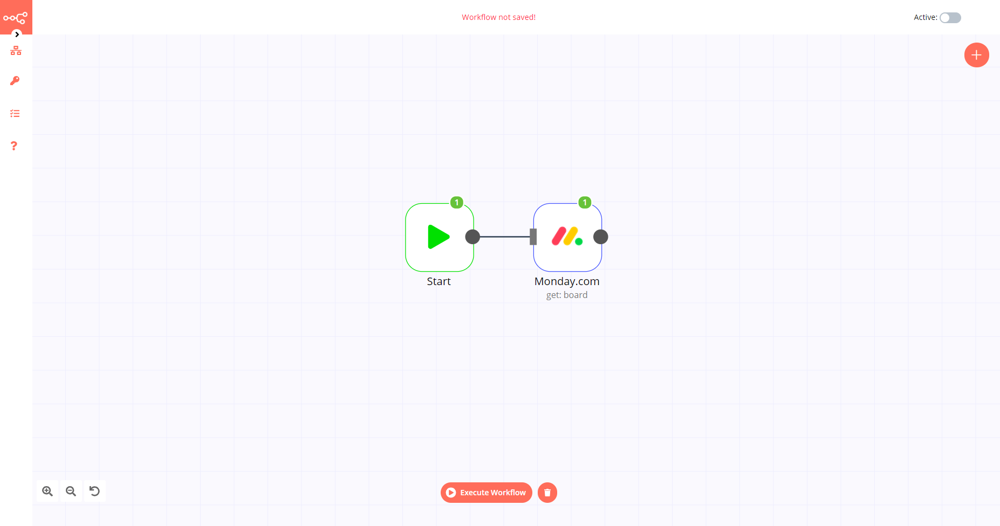

# monday.com

[monday.com](https://monday.com/) is a work operating system that enables organizations to manage tasks, projects, and team work.

::: tip 🔑 Credentials
You can find authentication information for this node [here](../../../credentials/Mondaycom/README.md).
:::

## Basic Operations

<Resource node="n8n-nodes-base.mondayCom" />

## Example Usage

This workflow allows you to get a board from monday.com. You can also find the [workflow](https://n8n.io/workflows/556) on the website. This example usage workflow would use the following two nodes.
- [Start](../../core-nodes/Start/README.md)
- [monday.com]()

The final workflow should look like the following image.

### 1. Start node

The start node exists by default when you create a new workflow.

### 2. monday.com node

1. First of all, you'll have to enter credentials for the monday.com node. You can find out how to do that [here](../../../credentials/Mondaycom/README.md).
2. Select the 'Get' option from the *Operation* dropdown list.
3. Select the board you want to get from the *Board ID* dropdown list.
4. Click on *Execute Node* to run the workflow.
