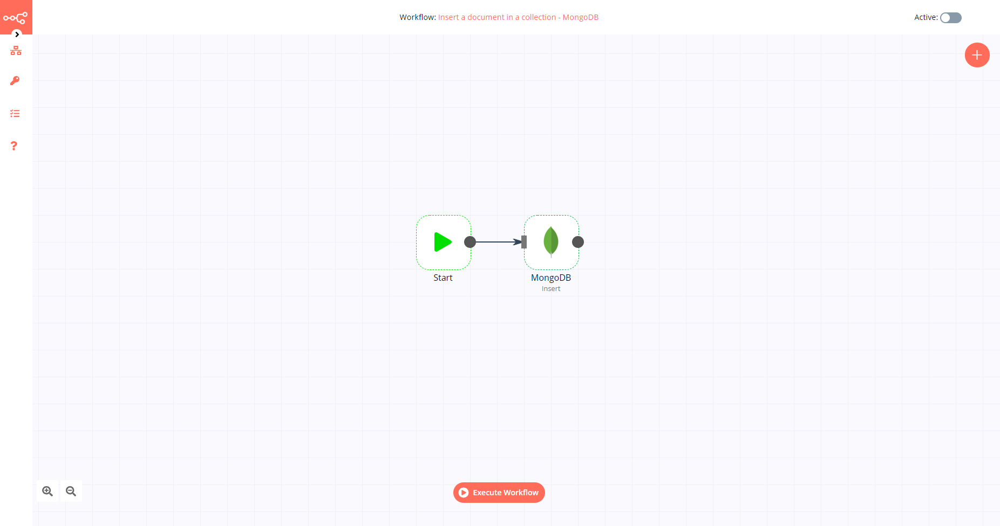

# MongoDB

[MongoDB](https://www.mongodb.com/) is a cross-platform document-oriented database program developed by MongoDB Inc. It is classified as a NoSQL database program. MongoDB uses JSON-like documents with optional schemas. 

::: tip 🔑 Credentials
You can find authentication information for this node [here](../../../credentials/MongoDB/README.md).
:::

## Basic Operations

- Insert documents
- Find documents
- Delete documents
- Update documents

## Example Usage

This workflow allows you to insert a document into a MongoDB collection. You can also find the [workflow](https://n8n.io/workflows/503) on the website. This example usage workflow would use the following two nodes.
- [Start](../../core-nodes/Start/README.md)
- [MongoDB]()

The final workflow should look like the following image.

### 1. Start node

The start node exists by default when you create a new workflow.

### 2. MongoDB node

1. First of all, you'll have to enter credentials for the MongoDB node. You can find out how to do that [here](../../../credentials/MongoDB/README.md).
2. Select 'Insert' from the *Operation* dropdown list.
3. Enter the name of your MongoDB collection in the *Collection* field.
4. Enter the values you want to insert into your collection in the *Fields* field.
5. Click on *Execute Node* to run the workflow.
