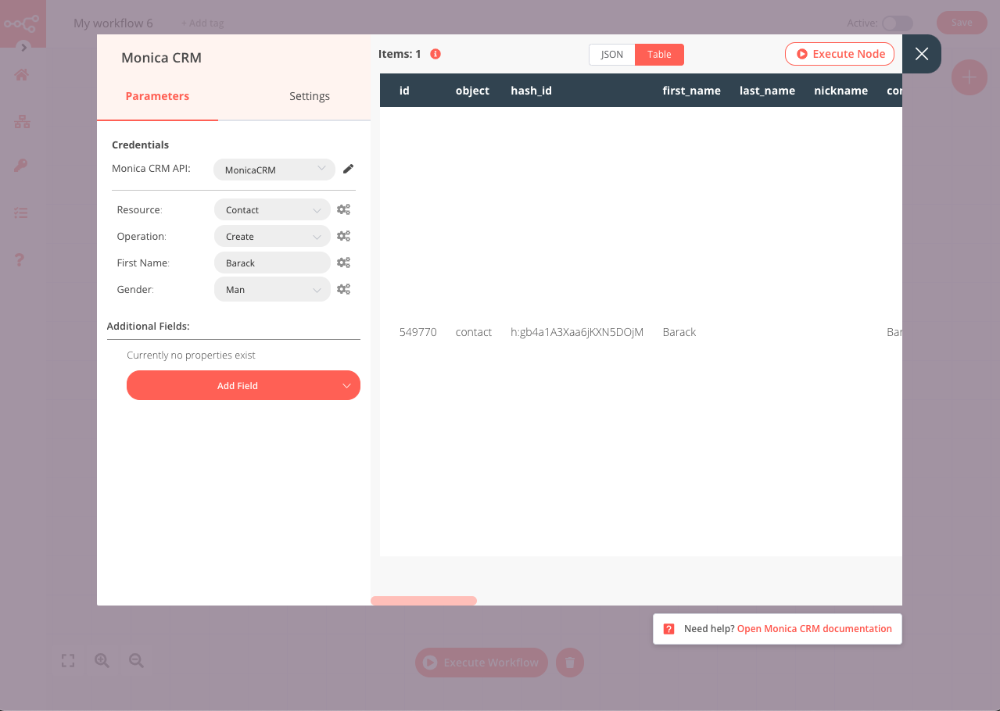

# Monica CRM

[Monica CRM](https://www.monicahq.com/) is an open-source web application to organize and record your interactions with your loved ones.

::: tip 🔑 Credentials
You can find authentication information for this node [here](../../../credentials/MonicaCrm/README.md).
:::

## Basic operations

<Resource node="n8n-nodes-base.monicaCrm" />

## Example usage

This workflow allows you to create a new contact in Monica CRM. This example usage workflow would use the following three nodes.
- [Start](../../core-nodes/Start/README.md)
- [Monica CRM]()

The final workflow should look like the following image.

### 1. Start node

The start node exists by default when you create a new workflow.

### 2. Monica CRM node

1. First enter your credentials for the Monica CRM node. You can find out how to do that [here](../../../credentials/MonicaCRM/README.md).
2. Select *Contact* from the *Resource* dropdown list.
3. Select *Create* from the *Operation* dropdown list.
3. Enter the *First Name* of your new contact.
4. Enter the *Gender* of your new contact using the dropdown list.
5. Click on *Execute Node* to run the workflow.

