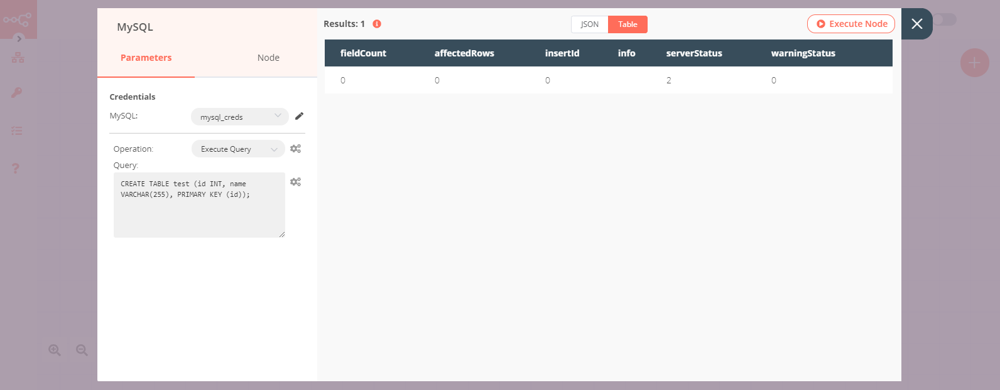

# MySQL

[MySQL](https://www.mysql.com/) is an open-source relational database management system. MySQL has stand-alone clients that allow users to interact directly with a MySQL database using SQL, but more often MySQL is used with other programs to implement applications that need relational database capability. 

::: tip 🔑 Credentials
You can find authentication information for this node [here](../../../credentials/MySQL/README.md).
:::

## Basic Operations

- Execute an SQL query
- Insert rows in database
- Update rows in database

## Example Usage

This workflow allows you to create a table and insert data in it on a MySQL database. You can also find the [workflow](https://n8n.io/workflows/598) on the website. This example usage workflow would use the following three nodes.
- [Start](../../core-nodes/Start/README.md)
- [Set](../../core-nodes/Set/README.md)
- [MySQL]()

The final workflow should look like the following image.

### 1. Start node

The start node exists by default when you create a new workflow.

### 2. MySQL node (Execute Query)

1. First of all, you'll have to enter credentials for the MySQL node. You can find out how to do that [here](../../../credentials/MySQL/README.md).
2. Select 'Execute Query' from the ***Operation*** dropdown list.
3. Enter the following SQL query in the ***Query*** field: `CREATE TABLE test (id INT, name VARCHAR(255), PRIMARY KEY (id));`.
4. Click on ***Execute Node*** to run the node.

### 3. Set node

1. Set the ***Keep Only Set*** toggle to true.
2. Click on the ***Add Value*** button and select 'Number' from the dropdown list.
3. Enter `id` in the ***Name*** field.
4. Click on the ***Add Value*** button and select 'String' from the dropdown list.
5. Enter `name` in the ***Name*** field.
6. Enter the value for the name in the ***Value*** field.
7. Click on ***Execute Node*** to run the node.

### 4. MySQL node (Insert)

1. Select the credentials that you entered in the previous MySQL node.
2. Enter `test` in the ***Table*** field.
3. Enter `id, name` in the ***Columns*** field.
4. Click on ***Execute Node*** to run the node.

