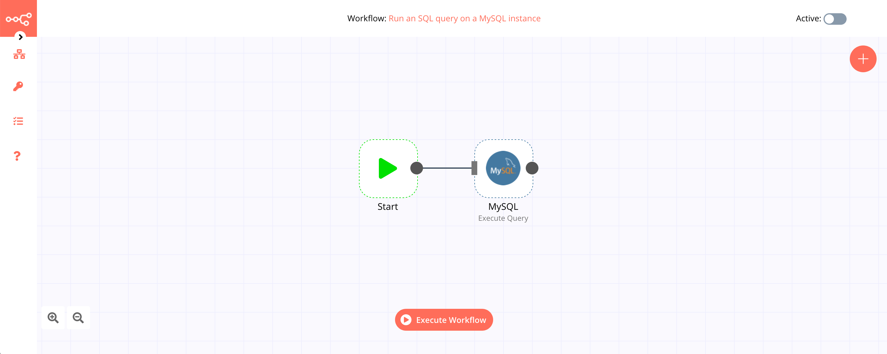

# MySQL

[MySQL](https://www.mysql.com/) is an open-source relational database management system. MySQL has stand-alone clients that allow users to interact directly with a MySQL database using SQL, but more often MySQL is used with other programs to implement applications that need relational database capability. 

::: tip 🔑 Credentials
You can find authentication information for this node [here](../../../credentials/MySQL/README.md).
:::

## Basic Operations

- Execute an SQL query
- Insert rows in database
- Update rows in database

## Example Usage

This workflow allows you to run an SQL query on a MySQL instance. You can also find the [workflow](https://n8n.io/workflows/492) on the website. This example usage workflow would use the following two nodes.
- [Start](../../core-nodes/Start/README.md)
- [MySQL]()

The final workflow should look like the following image.

### 1. Start node

The start node exists by default when you create a new workflow.

### 2. MySQL node

1. First of all, you'll have to enter credentials for the MySQL node. You can find out how to do that [here](../../../credentials/MySQL/README.md).
2. Select 'Execute Query' from the *Operation* dropdown list.
3. Enter your SQL query in the *Query* field.
4. Click on *Execute Node* to run the workflow.
