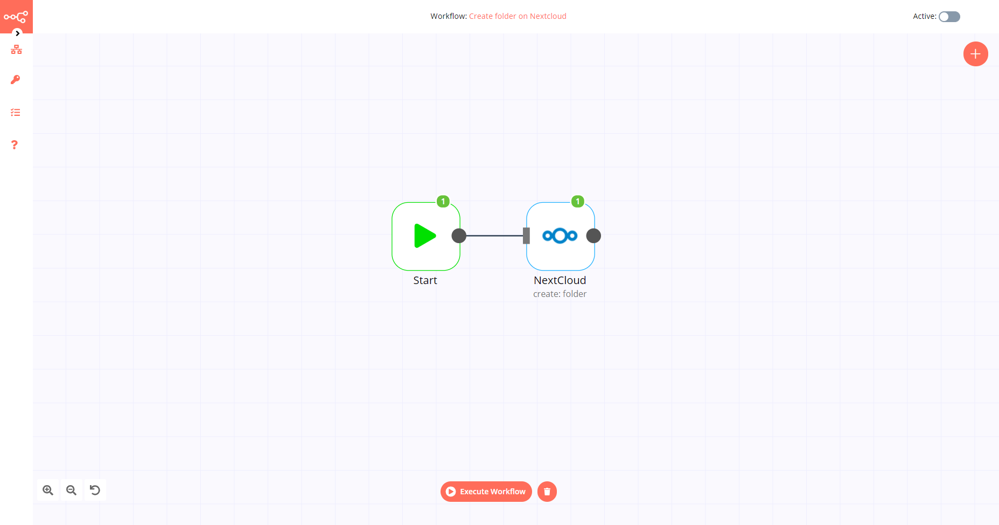
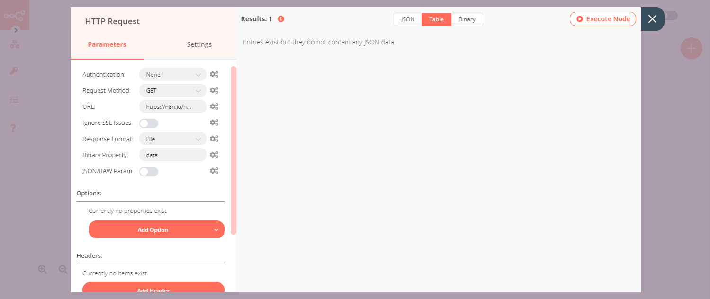

# Nextcloud

[Nextcloud](https://nextcloud.com/) is a free and open-source suite of client-server software for creating and using file hosting services.

::: tip 🔑 Credentials
You can find authentication information for this node [here](../../../credentials/Nextcloud/README.md).
:::

## Basic Operations

- File
	- Copy a file
	- Delete a file
	- Download a file
	- Move a file
	- Upload a file
- Folder
	- Copy a folder
	- Create a folder
	- Delete a folder
	- Return the contents of a folder
	- Move a folder

## Example Usage

This workflow allows you to create a folder in Nextcloud, upload a file into that folder, and list the contents of the folder. You can also find the [workflow](https://n8n.io/workflows/620) on the website. This example usage workflow would use the following nodes.
- [Start](../../core-nodes/Start/README.md)
- [Nextcloud]()
- [HTTP Request](../../core-nodes/HTTPRequest/README.md)

The final workflow should look like the following image.

### 1. Start node

The start node exists by default when you create a new workflow.

### 2. NextCloud node (create: folder)

1. First of all, you'll have to enter credentials for the Nextcloud node. You can find out how to do that [here](../../../credentials/Nextcloud/README.md).
2. Select the 'Folder' option from the *Resource* dropdown list.
3. Enter a folder name in the *Folder* field.
4. Click on *Execute Node* to run the workflow.

### 3. HTTP Request node (GET)

1. Enter `https://n8n.io/n8n-logo.png` in the ***URL*** field.
2. Select 'File' from the ***Response Format*** dropdown list.
3. Click on ***Execute Node*** to run the workflow.

### 4. NextCloud1 node (upload: file)

1. Select the credentials that you entered in the Nextcloud node.
2. Enter the path of the Nextcloud folder you created in the previous steps along with a file name in the ***File Path*** field.
3. Set the ***Binary Data*** toggle to true.
4. Click on ***Execute Node*** to run the node.

### 5. NextCloud2 node (list: folder)

1. Select the credentials that you entered in the Nextcloud node.
2. Select 'Folder' from the ***Resource*** dropdown list.
3. Select 'List' from the ***Operation*** dropdown list.
4. Enter the name of the Nextcloud folder you created in the previous steps in the ***Folder Path*** field.
5. Click on ***Execute Node*** to run the node.

