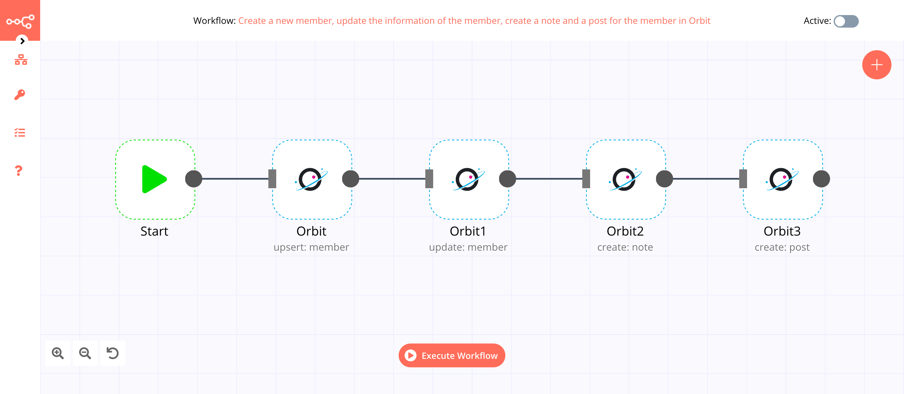
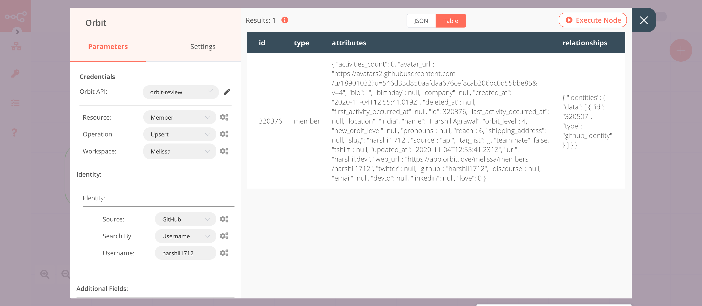

# Orbit

[Orbit](https://orbit.love) is a platform for managing and growing communities.

::: tip 🔑 Credentials
You can find authentication information for this node [here](../../../credentials/Orbit/README.md).
:::

## Basic Operations

::: details Activity
- Create an activity for a member
- Get all activities
:::

::: details Member
- Delete a member
- Get a member
- Get all members in a workspace
- Lookup a member by identity
- Update a member
- Create/Update a member
:::

::: details Note
- Create a note
- Get all notes for a member
- Update a note
:::

::: details Post
- Create a post
- Get all posts
- Delete a post
:::

## Example Usage

This workflow allows you to create a new member and update their information in Orbit using the Orbit node. It also allows you to create a note and a post for the new member in Orbit. You can also find the [workflow](https://n8n.io/workflows/765) on n8n.io. This example usage workflow uses the following nodes.
- [Start](../../core-nodes/Start/README.md)
- [Orbit]()

The final workflow should look like the following image.

### 1. Start node

The Start node exists by default when you create a new workflow.

### 2. Orbit node (upsert: member)

This node will create a new member in a workspace in Orbit. We will use the GitHub identity to create a new member.

1. First of all, you'll have to enter credentials for the Orbit node. You can find out how to do that [here](../../../credentials/Orbit/README.md).
2. Select 'Upsert' from the ***Operation*** dropdown list.
3. Select the workspace where you want to create a new member from the ***Workspace*** dropdown list.
4. Click on the ***Add Identity*** button.
5. Select 'GitHub' from the ***Source*** dropdown list.
6. Select 'Username' from the ***Search By*** dropdown list.
7. Enter the GitHub username of the member in the ***Username*** field.
8. Click on ***Execute Node*** to run the node.

In the screenshot below, you will notice that the node creates a new member in a workspace in Orbit using the GitHub identity.

### 3. Orbit1 node (update: member)

This node will update the tags of the member that we created in the previous node.
::: v-pre
1. Select the credentials that you entered in the previous node.
2. Select 'Update' from the ***Operation*** dropdown list.
3. Click on the gears icon next to the ***Workspace*** field and click on ***Add Expression***.
4. Select the following in the ***Variable Selector*** section: Nodes > Orbit > Parameters > workspaceId. You can also add the following expression: `{{$node["Orbit"].parameter["workspaceId"]}}`.
5. Click on the gears icon next to the ***Member ID*** field and click on ***Add Expression***.
6. Select the following in the ***Variable Selector*** section: Nodes > Orbit > Output Data > JSON > id. You can also add the following expression: `{{$node["Orbit"].json["id"]}}`.
7. Click on the ***Add Field*** button and select 'Tags to Add'.
8. Enter the tags in the ***Tags to Add*** field. You can add multiple tags by separating them with a comma.
9. Click on ***Execute Node*** to run the node.
:::
In the screenshot below, you will notice that the node updates the information of the new member that we created in the previous node. The node adds the tags `n8nConf` and `MLH` to the new member.

### 4. Orbit2 node (create: note)

This node will create a note for the member that we created using the Orbit node.
:::v-pre
1. Select the credentials that you entered in the previous node.
2. Select 'Note' from the ***Resource*** dropdown list.
3. Click on the gears icon next to the ***Workspace*** field and click on ***Add Expression***.
4. Select the following in the ***Variable Selector*** section: Nodes > Orbit > Parameters > workspaceId. You can also add the following expression: `{{$node["Orbit"].parameter["workspaceId"]}}`.
5. Click on the gears icon next to the ***Member ID*** field and click on ***Add Expression***.
6. Select the following in the ***Variable Selector*** section: Nodes > Orbit > Output Data > JSON > id. You can also add the following expression: `{{$node["Orbit"].json["id"]}}`.
7. Enter a note in the ***Note*** field.
8. Click on ***Execute Node*** to run the node.
:::
In the screenshot below, you will notice that the node creates a note for the member that we created using the Orbit node.

### 5. Orbit3 node (create: post)

This node will create a post for the member that we created using the Orbit node.

:::v-pre
1. Select the credentials that you entered in the previous node.
2. Select 'Post' from the ***Resource*** dropdown list.
3. Click on the gears icon next to the ***Workspace*** field and click on ***Add Expression***.
4. Select the following in the ***Variable Selector*** section: Nodes > Orbit > Parameters > workspaceId. You can also add the following expression: `{{$node["Orbit"].parameter["workspaceId"]}}`.
5. Click on the gears icon next to the ***Member ID*** field and click on ***Add Expression***.
6. Select the following in the ***Variable Selector*** section: Nodes > Orbit > Output Data > JSON > id. You can also add the following expression: `{{$node["Orbit"].json["id"]}}`.
7. Enter a URL for the post in the ***URL*** field.
8. Click on ***Execute Node*** to run the node.
:::
In the screenshot below, you will notice that the node creates a post for the member that we created using the Orbit node.

## Further Reading

<FurtherReadingBlog node="Orbit" />
