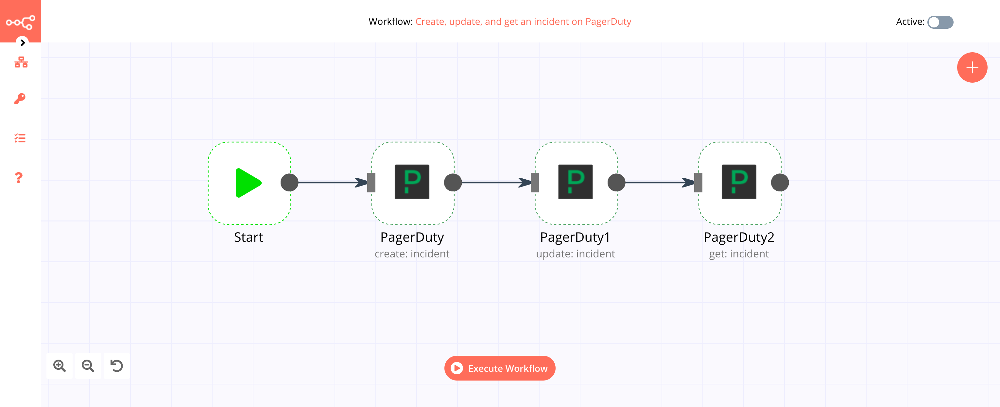

# PagerDuty

[PagerDuty](https://www.pagerduty.com/) is a cloud computing company that produces a SaaS incident response platform for IT departments.

You can find authentication information for this node [here](../../../credentials/PagerDuty/README.md).

## Basic Operations

- Incident
    - Create an incident
    - Get an incident
    - Get all incidents
    - Update an incident
- Incident Note
    - Create an incident note
    - Get all incident's notes
- Log Entry
    - Get a log entry
    - Get all log entries
- User
    - Get a user

## Example Usage

This workflow allows you to create an incident on PagerDuty. You can also find the [workflow](https://n8n.io/workflows/411) on the website. This example usage workflow would use the following two nodes.
- [Start](../../core-nodes/Start/README.md)
- [PagerDuty]()

The final workflow should look like the following image.

### 1. Start node

The start node exists by default when you create a new workflow.

### 2. PagerDuty node

1. First of all, you'll have to enter credentials for the PagerDuty node. You can find out how to do that [here](../../../credentials/PagerDuty/README.md).
2. Enter the title of the incident in the *Title* field.
3. Select the *Service ID* from the dropdown list.
4. Enter your email in the *Email* field.
5. Click on *Execute Node* to run the workflow.
