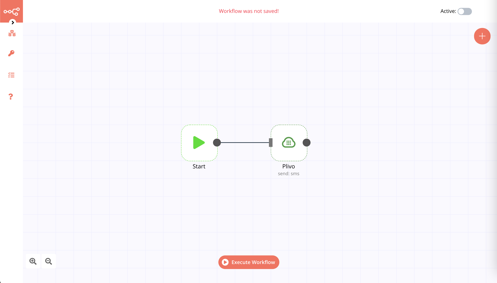

# Plivo

[Plivo](https://www.plivo.com/) is a cloud communications platform as a service company. Plivo allows you to add SMS, MMS, & Voice calling functionality within your apps programmatically.

::: tip 🔑 Credentials
You can find authentication information for this node [here](../../../credentials/Plivo/README.md).
:::

## Basic Operations

::: details SMS
- Send SMS message
:::

::: details MMS
- Send MMS message
:::

::: details Call
- Make a call
:::

## Example Usage

This workflow allows you to send an SMS message to a specified phone number from your Plivo number. Also, you can use the Plivo node to send an MMS message or to make a call to a specified number and leave a text-to-speech message using [Plivo XML](https://www.plivo.com/docs/voice/xml/speak#play-a-message). You can also find the [workflow](https://n8n.io/workflows/1002) on the website. This example usage workflow would use the following two nodes.
- [Start](../../core-nodes/Start/README.md)
- [Plivo]()

The final workflow should look like the following image.

### 1. Start node

The start node exists by default when you create a new workflow.

### 2. Plivo node

1. First of all, you'll have to enter credentials for the Plivo node. You can find out how to do that [here](../../../credentials/Plivo/README.md).
2. Enter the phone number from which you'll be sending the message in the *From* field.
3. Enter the phone number to which you'll be sending the message in the *To* field.
4. Enter you message in the *Message* field.
5. Click on *Execute Node* to run the workflow.
