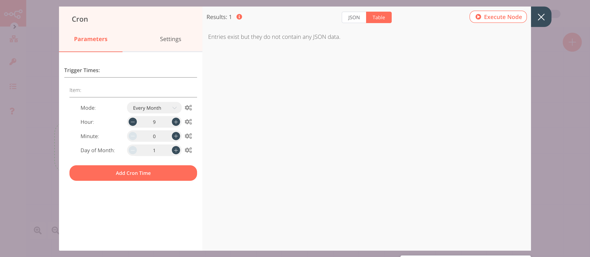
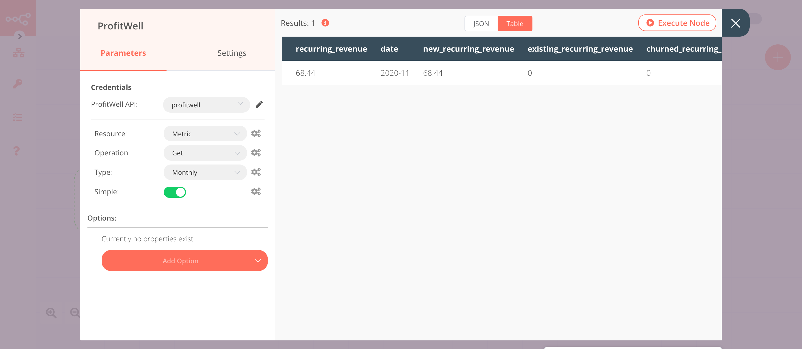

# ProfitWell

[ProfitWell](https://www.profitwell.com/) provides real-time subscription financial metrics.

::: tip 🔑 Credentials
You can find authentication information for this node [here](../../../credentials/ProfitWell/README.md).
:::

## Basic Operations

<Resource node="n8n-nodes-base.profitWell" />

## Example Usage

This workflow allows you to send financial metrics monthly to a Mattermost channel. You can also find the [workflow](https://n8n.io/workflows/798) on n8n.io. This example usage workflow uses the following nodes.
- [Cron](../../core-nodes/Cron/README.md)
- [ProfitWell]()
- [Mattermost](../../nodes/Mattermost/README.md)

The final workflow should look like the following image.


### 1. Cron node

The Cron node will trigger the workflow on the first day of every month at 9 AM.

1. Click on ***Add Cron Time***.
2. Select 'Every Month' from the ***Mode*** dropdown list.
3. Set hours to 9 in the ***Hour*** field.
4. Click on ***Execute Node*** to run the node.

In the screenshot below, you will notice that the Cron node is configured to trigger the workflow on the first day of every month at 9 AM.



### 2. ProfitWell node (get: metric)

This node will return monthly financial metrics.

1. First of all, you'll have to enter credentials for the ProfitWell node. You can find out how to do that [here](../../../credentials/ProfitWell/README.md).
2. Select 'Monthly' from the ***Type*** dropdown list.
3. Click on ***Execute Node*** to run the node.

In the screenshot below, you will notice that the node returns montly financial metrics.



### 3. Mattermost node (post: message)

This node will send a message with the metrics that we get from the previous node in the 'Monthly Metrics' channel in Mattermost. If you have a different channel, use that instead.

1. First of all, you'll have to enter credentials for the Mattermost node. You can find out how to do that [here](../../../credentials/Mattermost/README.md).
::: v-pre
2. Select a channel from the ***Channel ID*** dropdown list.
3. Click on the gears icon next to the ***Message*** field and click on ***Add Expression***.
4. Enter the following message in the ***Expression*** field:
```
Active Customers: {{$node["ProfitWell"].json["active_customers"]}}
Trailing Customers: {{$node["ProfitWell"].json["active_trialing_customers"]}}
New Customers: {{$node["ProfitWell"].json["new_customers"]}}
Growth Rate: {{$node["ProfitWell"].json["growth_rate"]}}
Recurring Revenue: {{$node["ProfitWell"].json["recurring_revenue"]}}
```
5. Click on ***Execute Node*** to run the node.
:::
In the screenshot below, you will notice that the node sends a message with the metrics that we get from the previous node.


::: tip 💡 Activate workflow for production
This example workflow uses the Cron node, which is a Trigger node. You'll need to save the workflow and then click on the Activate toggle on the top right of the screen to activate the workflow. Your workflow will then be triggered as specified by the settings in the Cron node.
:::
