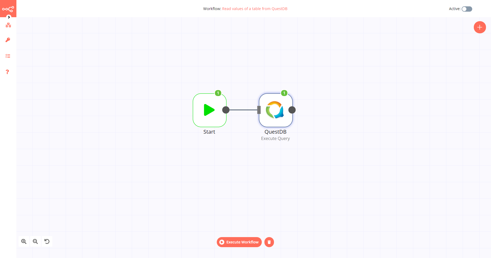

# QuestDB

[QuestDB](https://questdb.io/) is an open-source NewSQL relational database designed to process time-series data, faster. QuestDB’s stack is engineered from scratch, zero-GC Java and dependency-free. It supports a a Java API, SQL via HTTP and the PostgreSQL wire protocol.

::: tip 🔑 Credentials
You can find authentication information for this node [here](../../../credentials/QuestDB/README.md).
:::

## Basic Operations

- Execute an SQL query
- Insert rows in database
- Update rows in database

## Example Usage

This workflow allows you to execute an SQL query in QuestDB. You can also find the [workflow](https://n8n.io/workflows/523) on the website. This example usage workflow would use the following two nodes.
- [Start](../../core-nodes/Start/README.md)
- [QuestDB]()

The final workflow should look like the following image.

### 1. Start node

The start node exists by default when you create a new workflow.

### 2. QuestDB node

1. First of all, you'll have to enter credentials for the QuestDB node. You can find out how to do that [here](../../../credentials/QuestDB/README.md).
2. Select 'Execute Query' from the *Operation* dropdown list.
3. Enter your SQL query in the *Query* field.
4. Click on *Execute Node* to run the workflow.
