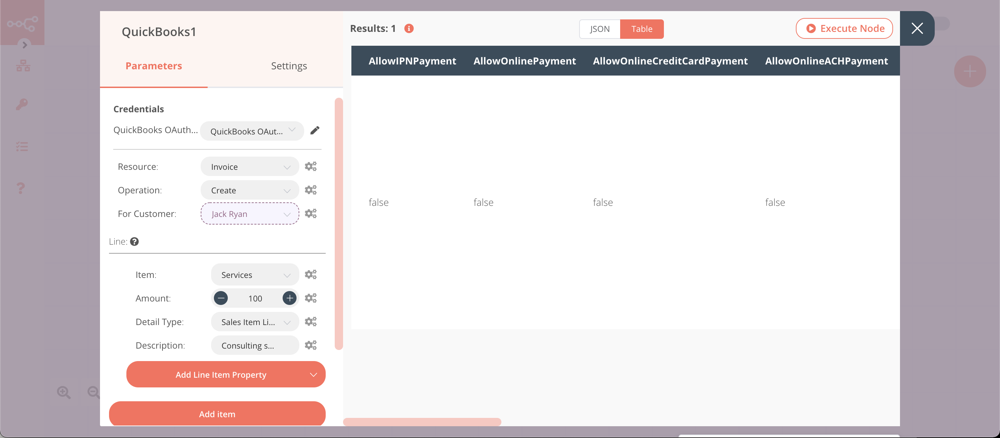
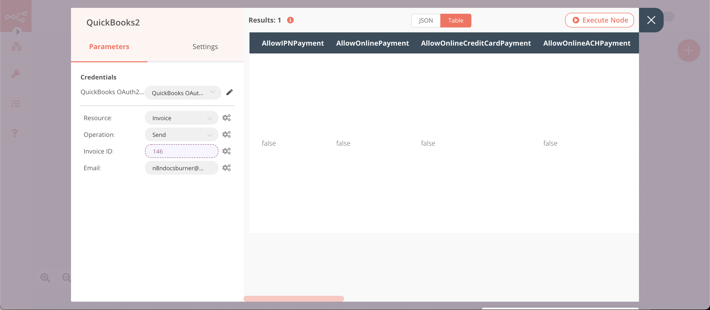

# QuickBooks

[QuickBooks](https://quickbooks.intuit.com) is an accounting software package developed by Intuit.

::: tip 🔑 Credentials
You can find authentication information for this node [here](../../../credentials/QuickBooks/README.md).
:::

## Basic Operations

::: details Bill
- Create a bill
- Delete a bill
- Get a bill
- Get all bills
:::

::: details Customer
- Create a customer
- Get a customer
- Get all customers
- Update a customer
:::

::: details Employee
- Create an employee
- Get an employee
- Get all employees
- Update an employee
:::

::: details Estimate
- Create an estimate
- Delete an estimate
- Get an estimate
- Get all estimates
- Send an estimate
- Update an estimate
:::

::: details Invoice
- Create an invoice
- Delete an invoice
- Get an invoice
- Get all invoices
- Send an invoice
- Update an invoice
- Void an invoice
:::

::: details Item
- Get an item
- Get all items
:::

::: details Payment
- Create a payment
- Delete a payment
- Get a payment
- Get all payment
- Send a payment
- Update a payment
- Void a payment
:::

::: details Vendor
- Create a vendor
- Get a vendor
- Get all vendors
- Update a vendor
:::

## Example Usage

This workflow allows you to create a customer and an invoice, and send the invoice to the customer. You can also find the [workflow](https://n8n.io/workflows/949) on n8n.io. This example usage workflow uses the following nodes.
- [Start](../../core-nodes/Start/README.md)
- [QuickBooks]()

The final workflow should look like the following image.

### 1. Start node

The Start node exists by default when you create a new workflow.

### 2. QuickBooks node (create:customer)

This node will create a new customer in QuickBooks.

1. First of all, you'll have to enter credentials for the QuickBooks node. You can find out how to do that [here](../../../credentials/QuickBooks/README.md).
2. Select 'Create' from the ***Operation*** dropdown list.
3. Enter a display name in the ***Display Name*** field.
4. Click on the ***Add Field*** button and select 'Primary Email Address'.
5. Enter the email address of the customer in the ***Primary Email Address*** field.
6. Click on ***Execute Node*** to run the node.

In the screenshot below, you will notice that the node creates a new customer.

### 3. QuickBooks1 node (create:invoice)

This node will create an invoice for the customer that we created in the previous node.

::: v-pre
1. Select the credentials that you entered in the previous node.
2. Select 'Invoice' from the ***Resource*** dropdown list.
3. Select 'Create' from the ***Operation*** dropdown list.
4. Click on the gears icon next to the ***For Customer*** field and click on ***Add Expression***.
5. Select the following in the ***Variable Selector*** section: Current Node > Input Data > JSON > Id. You can also add the following expression: `{{$json["Id"]}}`.
6. Click on the ***Add Item*** button.
7. Select 'Item' from the ***Add Line Item Property*** dropdown list.
8. Select an item from the ***Item*** dropdown list.
9. Select 'Amount' from the ***Add Line Item Property*** dropdown list.
10. Enter an amount in the ***Amount*** field.
11. Select 'Detail Type' from the ***Add Line Item Property*** dropdown list.
12. Select a type from the ***Detail Type*** dropdown list.
13. Select 'Description' from the ***Add Line Item Property*** dropdown list.
14. Enter a description in the ***Description*** field.
15. Click on ***Execute Node*** to run the node.
:::
In the screenshot below, you will notice that the node creates an invoice for the customer that we created in the previous node.

### 4. QuickBooks2 node (send:invoice)

This node will send the invoice that we created in the previous node.
::: v-pre
1. Select the credentials that you entered in the previous node.
2. Select 'Invoice' from the ***Resource*** dropdown list.
3. Select 'Send' from the ***Operation*** dropdown list.
4. Click on the gears icon next to the ***Invoice ID*** field and click on ***Add Expression***.
5. Select the following in the ***Variable Selector*** section: Current Node > Input Data > JSON > Id. You can also add the following expression: `{{$json["Id"]}}`.
6. Enter the email address of the customer in the ***Email*** field.
7. Click on ***Execute Node*** to run the node.
:::

In the screenshot below, you will notice that the node sends the invoice to the customer.

