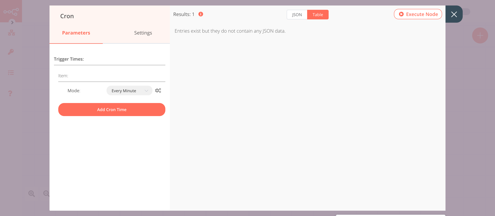

# RabbitMQ

[RabbitMQ](https://www.rabbitmq.com) is an open-source message broker that accepts and forwards messages.

::: tip 🔑 Credentials
You can find authentication information for this node [here](../../../credentials/RabbitMQ/README.md).
:::

## Example Usage

This workflow allows you to send updates about the position of the ISS every minute to a queue using the RabbitMQ node. You can also find the [workflow](https://n8n.io/workflows/844) on n8n.io. This example usage workflow uses the following nodes.
- [Cron](../../core-nodes/Cron/README.md)
- [HTTP Request](../../core-nodes/HTTPRequest/README.md)
- [Set](../../core-nodes/Set/README.md)
- [RabbitMQ]()

The final workflow should look like the following image.

### 1. Cron node

The Cron node will trigger the workflow every minute.

1. Click on ***Add Cron Time***.
2. Select 'Every Minute' from the ***Mode*** dropdown list.
3. Click on ***Execute Node*** to run the node.

In the screenshot below, you will notice that the Cron node is configured to trigger the workflow every minute.

### 2. HTTP Request node (GET)

This node will make a GET request to the API `https://api.wheretheiss.at/v1/satellites/25544/positions` to fetch the position of the ISS. This information gets passed on to the next node in the workflow.
::: v-pre
1. Enter `https://api.wheretheiss.at/v1/satellites/25544/positions` in the ***URL*** field.
2. Click on the ***Add Parameter*** button in the ***Query Parameters*** section.
3. Enter `timestamps` in the ***Name*** field.
4. Click on the gears icon next to the ***Value*** field and click on ***Add Expression***.
5. Enter the following expression: `{{Date.now()}}`. This expression will return the current timestamp.
6. Click on ***Execute Node*** to run the node.
:::
In the screenshot below, you will notice that the node makes a GET request to the API and returns the information about the location of the ISS.

### 3. Set node

We will use the Set node to ensure that only the data that we set in this node gets passed on to the next nodes in the workflow.
::: v-pre
1. Click on ***Add Value*** and select 'String' from the dropdown list.
2. Enter `Name` in the ***Name*** field.
3. Click on the gears icon next to the ***Value*** field and click on ***Add Expression***.
4. Select the following in the ***Variable Selector*** section: Nodes > HTTP Request > Output Data > JSON > 0 > name. You can also add the following expression: `{{$node["HTTP Request"].json["0"]["name"]}}`.
5. Click on ***Add Value*** and select 'String' from the dropdown list.
6. Enter `Latitude` in the ***Name*** field.
7. Click on the gears icon next to the ***Value*** field and click on ***Add Expression***.
8. Select the following in the ***Variable Selector*** section: Nodes > HTTP Request > Output Data > JSON > 0 > latitude. You can also add the following expression: `{{$node["HTTP Request"].json["0"]["latitude"]}}`.
9. Click on ***Add Value*** and select 'String' from the dropdown list.
10. Enter `Longitude` in the ***Name*** field.
11. Click on the gears icon next to the ***Value*** field and click on ***Add Expression***.
12. Select the following in the ***Variable Selector*** section: Nodes > HTTP Request > Output Data > JSON > 0 > longitude. You can also add the following expression: `{{$node["HTTP Request"].json["0"]["longitude"]}}`.
13. Click on ***Add Value*** and select 'String' from the dropdown list.
14. Enter `Timestamp` in the ***Name*** field.
15. Click on the gears icon next to the ***Value*** field and click on ***Add Expression***.
16. Select the following in the ***Variable Selector*** section: Nodes > HTTP Request > Output Data > JSON > 0 > timpestamp. You can also add the following expression: `{{$node["HTTP Request"].json["0"]["timestamp"]}}`.
17. Toggle ***Keep Only Set*** to `true`. We set this option to true to ensure that only the data that we have set in this node get passed on to the next nodes in the workflow.
18. Click on ***Execute Node*** to run the node.
:::
In the screenshot below, you will notice that the node uses the data from the previous node and returns the data that we set for the workflow.

### 4. RabbitMQ node

This node will send the data from the previous node to the `iss-position` queue in RabbitMQ. If you have created a queue with a different name in RabbitMQ, you can use that queue instead.

1. First of all, you'll have to enter credentials for the RabbitMQ node. You can find out how to do that [here](../../../credentials/RabbitMQ/README.md).
2. Enter the name of the queue or topic in the ***Queue / Topic*** field.
3. Click on ***Execute Node*** to run the node.

In the screenshot below, you will notice that the node sends the data from the previous node to the `iss-position` queue in RabbitMQ.

::: tip 💡 Activate workflow for production
This example workflow uses the Cron node, which is a Trigger node. You'll need to save the workflow and then click on the Activate toggle on the top right of the screen to activate the workflow. Your workflow will then be triggered as specified by the settings in the Cron node.
:::
