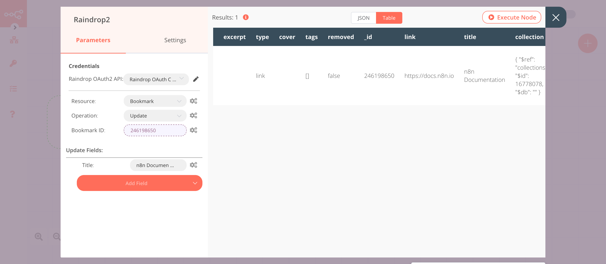

# Raindrop

[Raindrop](https://raindrop.io) is a bookmarking tool that allows you to organize your bookmarks.

::: tip 🔑 Credentials
You can find authentication information for this node [here](../../../credentials/Raindrop/README.md).
:::

## Basic Operations

<Resource node="n8n-nodes-base.raindrop" />

## Example Usage

This workflow allows you to create a collection and create, update, and get a bookmark in Raindrop. You can also find the [workflow](https://n8n.io/workflows/959) on n8n.io. This example usage workflow uses the following nodes.
- [Start](../../core-nodes/Start/README.md)
- [Raindrop]()

The final workflow should look like the following image.

### 1. Start node

The Start node exists by default when you create a new workflow.

### 2. Raindrop node (create: collection)

This node will create a new collection in Raindrop.

1. First of all, you'll have to enter credentials for the Raindrop node. You can find out how to do that [here](../../../credentials/Raindrop/README.md).
2. Select 'Create' from the ***Operation*** dropdown list.
3. Enter a title in the ***Title*** field.
4. Click on ***Execute Node*** to run the node.

In the screenshot below, you will notice that the node creates a new collection with the title `n8n-docs`.

### 3. Raindrop1 node (create: bookmark)

This node will create a new bookmark and add it to the collection that we created in the previous node.

::: v-pre
1. Select the credentials that you entered in the previous node.
2. Select 'Bookmark' from the ***Resource*** dropdown list.
3. Select 'Create' from the ***Operation*** dropdown list.
4. Click on the gears icon next to the ***Collection*** field and click on ***Add Expression***.
5. Select the following in the ***Variable Selector*** section: Current Node > Input Data > JSON > _id. You can also add the following expression: `{{$json["_id"]}}`.
6. Enter `https://docs.n8n.io` in the ***Link*** field.
7. Click on ***Add Field*** and select 'Title' from the dropdown list.
8. Enter `Documentation` in the ***Title*** field.
9. Click on ***Execute Node*** to run the node.
:::
In the screenshot below, you will notice that the node creates a new bookmark with the title `Documentation`.

### 4. Raindrop2 node (update: bookmark)

This node will update the bookmark that we created in the previous node.
::: v-pre
1. Select the credentials that you entered in the previous node.
2. Select 'Bookmark' from the ***Resource*** dropdown list.
3. Select 'Update' from the ***Operation*** dropdown list.
4. Click on the gears icon next to the ***Bookmark ID*** field and click on ***Add Expression***.
5. Select the following in the ***Variable Selector*** section: Current Node > Input Data > JSON > _id. You can also add the following expression: `{{$json["_id"]}}`.
6. Click on ***Add Field*** and select 'Title' from the dropdown list.
7. Enter `n8n Documentation` in the ***Title*** field.
8. Click on ***Execute Node*** to run the node.
:::

In the screenshot below, you will notice that the node updates the title of the bookmark that we created in the previous node.

### 5. Raindrop3 node (get: bookmark)

This node will return the information about the bookmark that we created earlier.
::: v-pre
1. Select the credentials that you entered in the previous node.
2. Select 'Bookmark' from the ***Resource*** dropdown list.
3. Click on the gears icon next to the ***Bookmark ID*** field and click on ***Add Expression***.
4. Select the following in the ***Variable Selector*** section: Current Node > Input Data > JSON > _id. You can also add the following expression: `{{$json["_id"]}}`.
5. Click on ***Execute Node*** to run the node.
:::

In the screenshot below, you will notice that the node returns the information on the bookmark that we created earlier.

