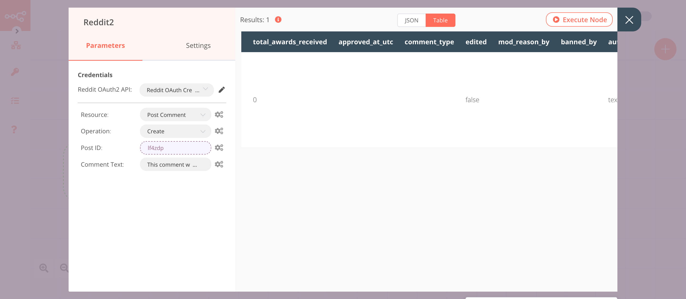

# Reddit

[Reddit](https://www.reddit.com) is a social news aggregation, web content rating, and discussion website.

::: tip 🔑 Credentials
You can find authentication information for this node [here](../../../credentials/Reddit/README.md).
:::

## Basic Operations

::: details Post
- Submit a post to a subreddit
- Delete a post from a subreddit
- Get a post from a subreddit
- Get all posts from a subreddit
:::

::: details Post Comment
- Create a top-level comment in a post
- Retrieve all comments in a post
- Remove comment from a post
- Write a reply to a comment in a post
:::

::: details Profile
- Get the profile of the logged-in user
:::

::: details Subreddit
- Retrieve background information about a subreddit
- Retrieve information about subreddits from all of Reddit
:::

::: details User
- Get information about a user
:::

## Example Usage

This workflow allows you to create a post a Reddit and add a comment to that post. You can also find the [workflow](https://n8n.io/workflows/928) on n8n.io. This example usage workflow uses the following nodes.
- [Start](../../core-nodes/Start/README.md)
- [Reddit]()

The final workflow should look like the following image.

### 1. Start node

The Start node exists by default when you create a new workflow.

### 2. Reddit node (create: post)

This node will create a post under the subreddit `n8n`. If you want to create a post under a different subreddit, enter the name of that subreddit instead.

1. First of all, you'll have to enter credentials for the Reddit node. You can find out how to do that [here](../../../credentials/Reddit/README.md).
2. Enter `n8n` in the ***Subreddit*** field.
3. Enter a title in the ***Title*** field.
4. Enter the content of the post in the ***Text*** field.
5. Click on ***Execute Node*** to run the node.

In the screenshot below, you will notice that the node creates a new post under the subreddit `n8n`.

### 3. Reddit1 node (get: post)

This node will retrieve the post that we created using the previous node.
::: v-pre
1. Select the credentials you entered in the previous node.
2. Select 'Get' from the ***Operation*** dropdown list.
3. Click on the gears icon next to the ***Subreddit*** field and click on ***Add Expression***.
4. Select the following in the ***Variable Selector*** section: Nodes > Reddit > Parameters > subreddit. You can also add the following expression: `{{$node["Reddit"].parameter["subreddit"]}}`.
5. Click on the gears icon next to the ***Post ID*** field and click on ***Add Expression***.
6. Select the following in the ***Variable Selector*** section: Current Node > Input Data > JSON > id. You can also add the following expression: `{{$json["id"]}}`.
7. Click on ***Execute Node*** to run the node.
:::
In the screenshot below, you will notice that the node returns the information of the post that we created in the previous node.

### 4. Reddit node (create: postComment)

This node will add a comment to the post that we created earlier.
::: v-pre
1. Select the credentials you entered in the previous node.
2. Select 'Post Comment' from the ***Resource*** dropdown list.
3. Click on the gears icon next to the ***Post ID*** field and click on ***Add Expression***.
4. Select the following in the ***Variable Selector*** section: Current Node > Input Data > JSON > id. You can also add the following expression: `{{$json["id"]}}`.
5. Enter your comment in the ***Comment Text*** field.
6. Click on ***Execute Node*** to run the node.
:::
In the screenshot below, you will notice that the node comments on the post that we created earlier.

