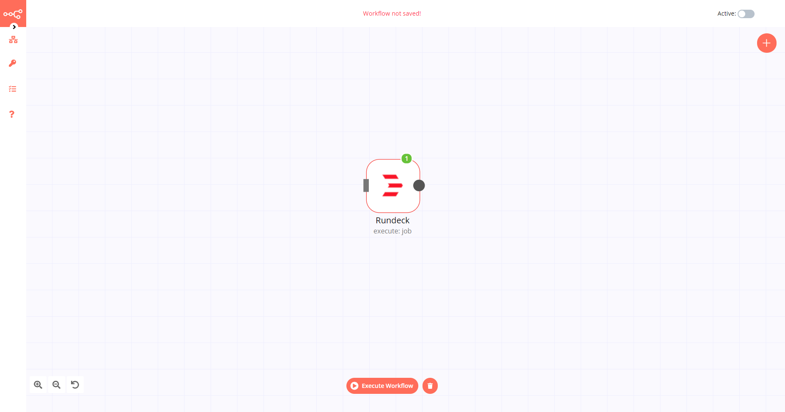

# Rundeck

[Rundeck](https://www.rundeck.com/) is an open-source runbook automation for incident management, business continuity, and self-service operations.

::: tip 🔑 Credentials
You can find authentication information for this node [here](../../../credentials/Rundeck/README.md).
:::

## Basic Operations

- Job
	- Execute a job
	- Get metadata of a job

## Example Usage

This workflow allows you to execute a job on Rundeck. You can also find the [workflow](https://n8n.io/workflows/539) on this website. This example usage workflow uses the following two nodes.

- [Start](../../core-nodes/Start/README.md)
- [Rundeck]()

The final workflow should look like the following image.

### 1. Start node

The start node exists by default when you create a new workflow.

### 2. Rundeck node

1. First of all, you'll have to enter credentials for the Rundeck node. You can find out how to do that [here](../../../credentials/Rundeck/README.md).
2. In your Rundeck jobs page, click on the job you want to execute in n8n.
3. Copy your Rundeck job ID, mentioned right below the job name.
4. Enter your Rundeck job ID in the *Job Id* field.
5. Click on *Execute Node* to run the workflow.
