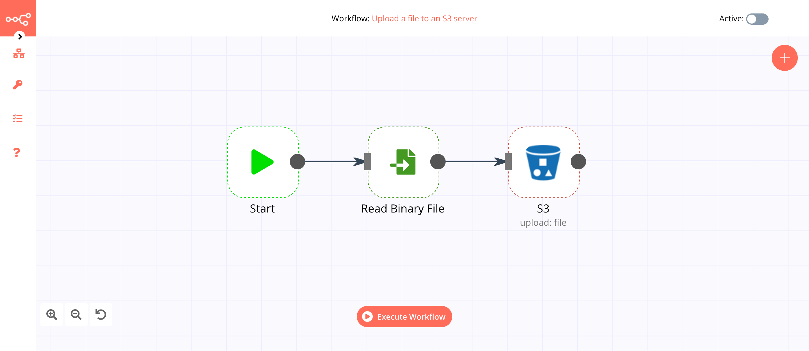
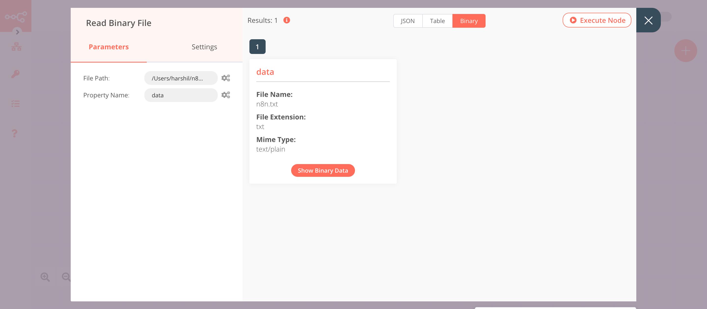
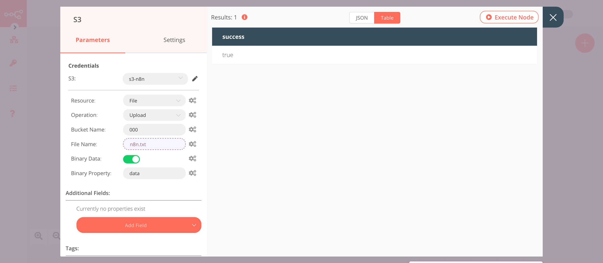

# S3

S3 is an object storage service that allows you to block public access to all of your objects at the bucket or the account level with S3 Block Public Access. S3 maintains compliance programs, such as PCI-DSS, HIPAA/HITECH, FedRAMP, EU Data Protection Directive, and FISMA, to help you meet regulatory requirements.

::: tip 🔑 Credentials
You can find authentication information for this node [here](../../../credentials/S3/README.md).
:::

## Basic Operations

- Bucket
    - Create a bucket
    - Get all buckets
    - Search within a bucket
- File
    - Copy a file
    - Delete a file
    - Download a file
    - Get all files
    - Upload a file
- Folder
    - Create a folder
    - Delete a folder
    - Get all folders

## Example Usage

This workflow allows you to upload a file on an S3 compatible server. You can also find the [workflow](https://n8n.io/workflows/592) on n8n.io. This example usage workflow would use the following nodes.
- [Start](../../core-nodes/Start/README.md)
- [Read Binary File](../../core-nodes/ReadBinaryFile/README.md)
- [S3]()

The final workflow should look like the following image.

### 1. Start node

The start node exists by default when you create a new workflow.

### 2. Read Binary File node

1. Enter the file path in the ***File Path*** field.
2. Click on ***Execute Node*** to run the node.

::: v-pre
### 3. S3 node (upload: file)

1. First of all, you'll have to enter credentials for the QuestDB node. You can find out how to do that [here](../../../credentials/S3/README.md).
2. Select 'Upload' from the ***Operation*** dropdown list.
3. Enter the bucket name in the ***Bucket Name*** field.
4. Click on the gears icon next to the ***File Name*** field and click on ***Add Expression***.
5. Select the following in the ***Variable Selector*** section: Nodes > Read Binary File > Output Data > Binary > data > fileName. You can also add the following expression: `{{$node["Read Binary File"].binary.data.fileName}}`.
6. Click on ***Execute Node*** to run the node.
:::

