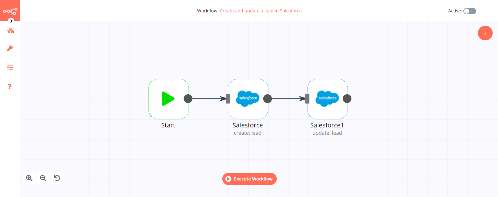
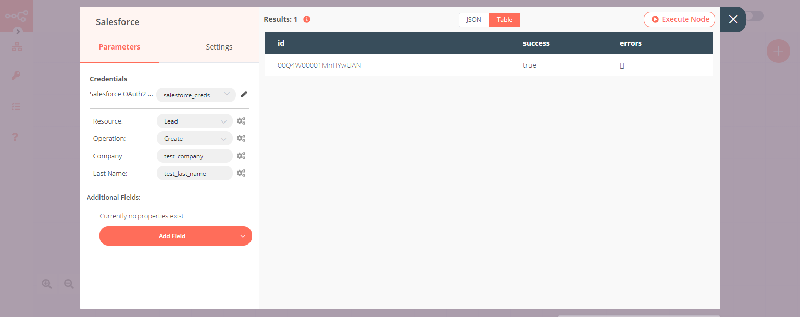
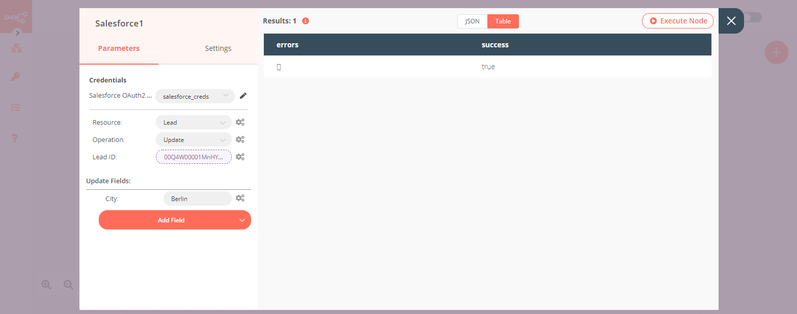

# Salesforce

[Salesforce](https://www.salesforce.com/) is a cloud-based software company. It provides customer relationship management service and also sells a complementary suite of enterprise applications focused on customer service, marketing automation, analytics, and application development.

::: tip 🔑 Credentials
You can find authentication information for this node [here](../../../credentials/Salesforce/README.md).
:::

## Basic Operations

::: details Account
- Add note to an account
- Create an account
- Get an account
- Get all accounts
- Get an overview of accounts
- Delete an account
- Update an account
:::

::: details Attachment
- Create an attachment
- Delete an attachment
- Get an attachment
- Get all attachments
- Get an overview of attachments metadata
- Update an attachment
:::

::: details Case
- Add a comment to a case
- Create a case
- Get a case
- Get all cases
- Get an overview of cases metadata
- Delete a case
- Update a case
:::

::: details Contact
- Add lead to a campaign
- Add note to a contact
- Create a contact
- Delete a contact
- Get a contact
- Get overview of contacts metadata
- Get all contacts
- Update a contact
:::

::: details Flow
- Invoke a flow
- List flows
:::

::: details Lead
- Add lead to a campaign
- Add note to a lead
- Create a lead
- Delete a lead
- Get a lead
- Get all leads
- Get summary of leads metadata
- Update a lead
:::

::: details Opportunity
- Add note to an opportunity
- Create an opportunity
- Delete an opportunity
- Get an opportunity
- Get all opportunities
- Get an overview of opportunities metadata
- Update an opportunity
:::

::: details Task
- Create a task
- Delete a task
- Get a task
- Get all tasks
- Get an overview of tasks metadata
- Update a task
:::

::: details User
- Get a user
- Get all users
:::

## Example Usage

This workflow allows you to create, update, and add a note to a lead in Salesforce. You can also find the [workflow](https://n8n.io/workflows/664) on n8n.io. This example usage workflow would use the following nodes.
- [Start](../../core-nodes/Start/README.md)
- [Salesforce]()

The final workflow should look like the following image.

### 1. Start node

The start node exists by default when you create a new workflow.

### 2. Salesforce node (create: lead)

1. First of all, you'll have to enter credentials for the Salesforce node. You can find out how to do that [here](../../../credentials/Salesforce/README.md).
2. Enter the name of the company in the ***Company*** field.
3. Enter the last name of the contact person in the ***Last Name*** field.
4. Click on ***Execute Node*** to run the node.

::: v-pre
### 3. Salesforce1 node (update: lead)

1. Select the credentials that you entered in the previous node.
2. Select 'Update' from the ***Operation*** dropdown list.
3. Click on the gears icon next to the ***Lead ID*** field and click on ***Add Expression***.
4. Select the following in the ***Variable Selector*** section: Nodes > Salesforce > Output Data > JSON > id. You can also add the following expression: `{{$node["Salesforce"].json["id"]}}`
5. Click on the ***Add Field*** button and select 'City' from the dropdown list.
6. Enter a city name in the ***City*** field.
7. Click on ***Execute Node*** to run the node.

:::

::: v-pre
### 4. Salesforce2 node (addNote: lead)

1. Select the credentials that you entered in the previous node.
2. Select ***Add Note*** from the ***Operation*** dropdown list.
3. Click on the gears icon next to the ***Lead ID*** field and click on ***Add Expression***.
4. Select the following in the ***Variable Selector*** section: Nodes > Salesforce > Output Data > JSON > id. You can also add the following expression: `{{$node["Salesforce"].json["id"]}}`
5. Enter the note in the ***Title*** field.
6. Click on ***Execute Node*** to run the node.

:::
