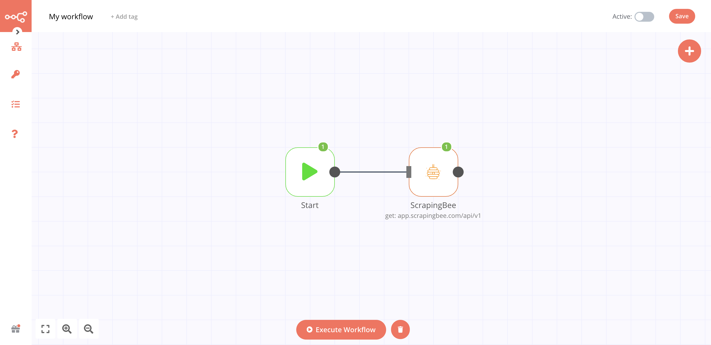

# ScrapingBee 🐝 

[ScrapingBee](https://www.scrapingbee.com/) API handles headless browsers and rotates proxies for you.

::: tip 🔑 Credentials
You can find authentication information for this node [here](../../../credentials/ScrapingBee/README.md).
:::

## Basic Operations

Retrieve a target URL.

## Example Usage

This workflow allows you to scrap a web page through ScrapingBee. This example usage workflow would use the following two nodes.
- [Start](../../core-nodes/Start/README.md)
- [ScrapingBee]()

The final workflow should look like the following image.

### 1. Start node

The start node exists by default when you create a new workflow.

### 2. ScrapingBee node

1. First of all, you'll have to enter credentials for the ScrapingBee node. You can find out how to do that [here](../../../credentials/ScrapingBee/README.md).
2. Enter the url you want to scrap into the "*Target URL*" field.
3. Click on "*Execute Node*" to run the workflow.

## Further Reading

- [API Documentation](https://www.scrapingbee.com/documentation/)

<FurtherReadingBlog />
