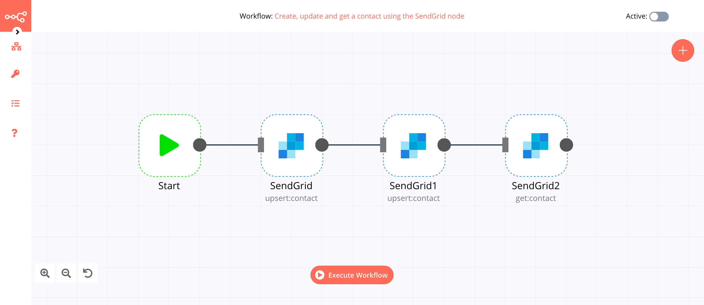

# SendGrid

[SendGrid](https://SendGrid.co) provides a cloud-based service that assists businesses with email delivery.

::: tip 🔑 Credentials
You can find authentication information for this node [here](../../../credentials/SendGrid/README.md).
:::

## Basic Operations

::: details Contact
- Create/Update a contact
- Delete a contact
- Get a contact by ID
- Get all contacts
:::

::: details List
- Create a list
- Delete a list
- Get a list
- Get all lists
- Update a list
:::

## Example Usage

This workflow allows you to create, update and get a contact using the SendGrid node. You can also find the [workflow](https://n8n.io/workflows/901) on n8n.io. This example usage workflow uses the following nodes.
- [Start](../../core-nodes/Start/README.md)
- [SendGrid]()

The final workflow should look like the following image.

### 1. Start node

The Start node exists by default when you create a new workflow.

### 2. SendGrid node (upsert:contact)

This node will create a contact in SendGrid.

1. First of all, you'll have to enter credentials for the SendGrid node. You can find out how to do that [here](../../../credentials/SendGrid/README.md).
2. Select 'Contact' from the ***Resource*** dropdown list.
3. Select 'Create/Update' from the ***Operation*** dropdown list.
4. Enter an email address in the ***Email*** field.
5. Click on the ***Add Field*** button and select 'First Name'.
6. Enter the name of the contact in the ***First Name*** field.
7. Click on ***Execute Node*** to run the node.

In the screenshot below, you will notice that the node creates contact with their first name.

### 3. SendGrid1 node (upsert:contact)

This node will update the contact that we created in the previous node.

::: v-pre
1. Select the credentials that you entered in the previous node.
2. Select 'Contact' from the ***Resource*** dropdown list.
3. Select 'Create/Update' from the ***Operation*** dropdown list.
4. Click on the gears icon next to the ***Email*** field and click on ***Add Expression***.
5. Select the following in the ***Variable Selector*** section: Nodes > SendGrid > Parameters > email. You can also add the following expression: `{{$node["SendGrid"].parameter["email"]}}`.
6. Click on the ***Add Field*** button and select 'Last Name'.
7. Enter the last name of the contact in the ***Last Name*** field.
8. Click on ***Execute Node*** to run the node.
:::
In the screenshot below, you will notice that the node updates the contact that we created in the previous node.

### 4. SendGrid2 node (get:contact)

This node will return the information of the contact that we created using the SendGrid node.
::: v-pre
1. Select the credentials that you entered in the previous node.
2. Select 'Contact' from the ***Resource*** dropdown list.
3. Select 'Get' from the ***Operation*** dropdown list.
4. Select 'Email' from the ***By*** dropdown list.
5. Click on the gears icon next to the ***Email*** field and click on ***Add Expression***.
6. Select the following in the ***Variable Selector*** section: Nodes > SendGrid > Parameters > email. You can also add the following expression: `{{$node["SendGrid"].parameter["email"]}}`.
7. Click on ***Execute Node*** to run the node.
:::

In the screenshot below, you will notice that the node returns the information of the contact that we created using the SendGrid node.

