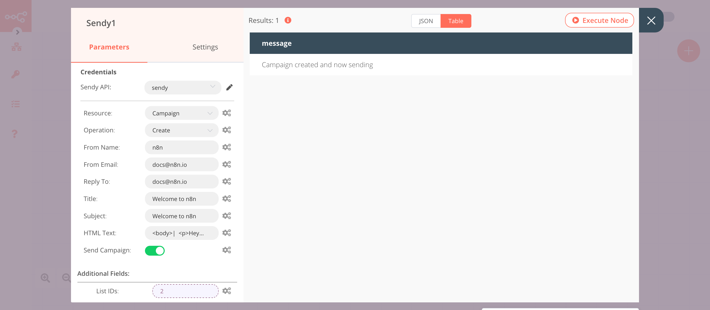

# Sendy

[Sendy](https://sendy.co) is a self-hosted email newsletter application that lets you send trackable emails via AWS SES.

::: tip 🔑 Credentials
You can find authentication information for this node [here](../../../credentials/Sendy/README.md).
:::

## Basic Operations

::: details Campaign
- Create a campaign
:::

::: details Subscriber
- Add a subscriber to a list
- Count subscribers
- Delete a subscriber from a list
- Unsubscribe a user from a list
- Get the status of a subscriber
:::

## Example Usage

This workflow allows you to add a subscriber to a list and create and send a campaign using the Sendy node. You can also find the [workflow](https://n8n.io/workflows/727) on n8n.io. This example usage workflow uses the following nodes.
- [Start](../../core-nodes/Start/README.md)
- [Sendy]()

The final workflow should look like the following image.

### 1. Start node

The Start node exists by default when you create a new workflow.

### 2. Sendy node (add: subscriber)

This node will add a subscriber to a list in Sendy. If you don't already have a list in Sendy, make sure to create one.

1. First of all, you'll have to enter credentials for the Sendy node. You can find out how to do that [here](../../../credentials/Sendy/README.md).
2. Enter the subscriber's email address in the ***Email*** field.
3. Paste the list id from Sendy in the ***List ID*** field in n8n.
4. Click on the ***Add Field*** button and select 'Name'.
5. Enter the name of the subscriber in the ***Name*** field.
6. Click on ***Execute Node*** to run the node.

In the screenshot below, you will notice that the node adds a subscriber with their name to the list that we specify.

### 3. Sendy1 node (create: campaign)

This node will create a campaign with the title 'Welcome to n8n' and send it to the subscribers of the list that we specify. 
::: v-pre
1. Select the credentials that you entered in the previous node.
2. Select 'Campaign' from the ***Resource*** dropdown list.
3. Enter the name of the sender in the ***From Name*** field.
4. Enter the email address of the sender in the ***From Email*** field.
5. Enter the email address where the subscribers can reply to in the ***Reply To*** field.
6. Enter the title of the campaign in the ***Title*** field.
7. Enter the subject of the email in the ***Subject*** field.
8. Enter the HTML snippet of the email campaign in the ***HTML Text*** field.
9. Toggle ***Send Campaign*** to true.
10. Click on the ***Add Field*** button and select 'List IDs'.
11. Click on the gears icon next to the ***List IDs*** field and click on ***Add Expression***.
12. Select the following in the ***Variable Selector*** section: Nodes > Sendy > Parameters > listId. You can also add the following expression: `{{$node["Sendy"].parameter["listId"]}}`.
13. Click on ***Execute Node*** to run the node.
:::
In the screenshot below, you will notice that the node creates the campaign with the title `Welcome to n8n` and sends it to the list that we specify.

