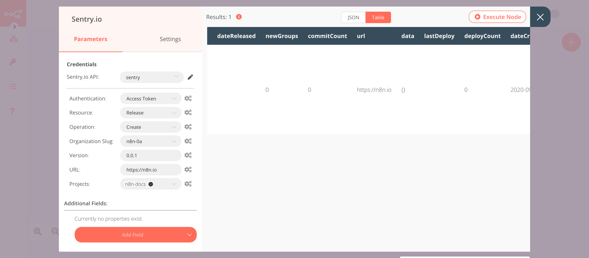

# Sentry.io

[Sentry.io](https://sentry.io) is a service that helps you monitor and fix crashes in realtime. Sentry’s platform helps every developer diagnose, fix, and optimize the performance of their code.

::: tip 🔑 Credentials
You can find authentication information for this node [here](../../../credentials/SentryIo/README.md).
:::

## Basic Operations

::: details Event
- Get event by ID
- Get all events
:::

::: details Issue
- Delete an issue
- Get issue by ID
- Get all issues
- Update an issue
:::

::: details Project
- Get project by ID
- Get all projects
:::

::: details Release
- Create a release
- Get release by a version identifier
- Get all releases
:::

::: details Organization
- Create an organization
- Get an organization by slug
- Get all organizations
:::

::: details Team
- Create a new team
- Get team by slug
- Get all teams
:::

## Example Usage

This workflow allows you to create a release and get all releases using the Sentry.io node. You can also find the [workflow](https://n8n.io/workflows/643) on n8n.io. This example usage workflow would use the following nodes.
- [Start](../../core-nodes/Start/README.md)
- [Sentry.io]()

The final workflow should look like the following image.

### 1. Start node

The start node exists by default when you create a new workflow.

### 2. Sentry.io node (create: release)

1. First of all, you'll have to enter credentials for the Sentry.io node. You can find out how to do that [here](../../../credentials/SentryIo/README.md).
2. Select 'Release' from the ***Resource*** dropdown list.
3. Select 'Create' from the ***Operation*** dropdown list.
4. Select the organization from the ***Organization Slug*** dropdown list.
5. Enter the version in the ***Version*** field. 
6. Enter the URL that points to the release in the ***URL*** field.
7. Select the project from ***Projects*** dropdown list.
8. Click on ***Execute Node*** to run the node.

::: v-pre
### 2. Sentry.io node (getAll: release)

1. Select the credentials that you entered in the previous Sentry.io node.
2. Select 'Release' from the ***Resource*** dropdown list.
3. Select 'Get All' from the ***Operation*** dropdown list.
4. Select the organization from the ***Organization Slug*** dropdown list.
5. Toggle ***Return All*** to true. 
6. Click on ***Execute Node*** to run the node.
:::

