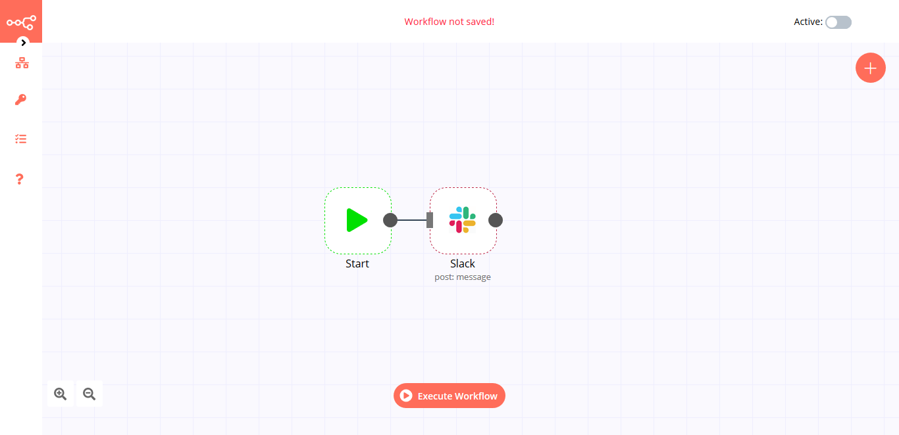

# Slack

[Slack](https://slack.com) is a business communication platform offering many IRC-style features, including persistent chat rooms (channels), private groups, and direct messaging.

::: tip 🔑 Credentials
You can find authentication information for this node [here](../../../credentials/Slack/README.md).
:::

## Basic Operations

::: details Channel
- Archive a conversation
- Close a direct message or multi-person direct message
- Create a public or private channel-based conversation
- Get information about a channel
- Get all channels in a Slack team
- Get a conversation's history of messages and events
- Invite a user to a channel
- Join an existing conversation
- Kick a user from a channel
- Leave a conversation
- Open or resume a direct message or multi-person direct message
- Rename a conversation
- Get a thread of replies posted to a channel
- Set the purpose for a conversation
- Set the topic for a conversation
- Unarchive a conversation
:::

::: details File
- Get a file's information
- Get and filter a team's files
- Upload an existing file or create a new one
:::

::: details Message
- Post a message in a channel
- Update a message
:::

::: details Star
- Add a star to an item
- Delete a star from an item
- Get all the stars of an authenticated user
:::

## Example Usage

This workflow shows you how to post a message in a Slack channel. You can also find the [workflow](https://n8n.io/workflows/416) on this website. This example usage workflow uses the following two nodes.
- [Start](../../core-nodes/Start)
- [Slack]()

The final workflow should look like the following image.

### 1. Start node

The Start node exists by default when you create a new workflow.

### 2. Slack Node

1. Click on the plus button, search for "Slack", select it and double-click on the new node.
2. Select OAuth2 in the *Authentication* field and select "Create new" in the *Slack OAuth2 API* field.
3. Create a credential as shown in [this tutorial](../../../credentials/Slack/).
4. Enter the name of the channel in the *Channel* field.
5. Enter the text of the message to be posted in *Text* field.
6. Browse the *Attachments*, *Other Options*, and *Blocks* to see if you would like to use any of them.
7. Click on *Execute Node* to run the workflow.

## Further Reading

- [Giving kudos to contributors with GitHub, Slack, and n8n 👏](https://medium.com/n8n-io/giving-kudos-to-contributors-with-github-slack-and-n8n-b3f5f4a653a6)
