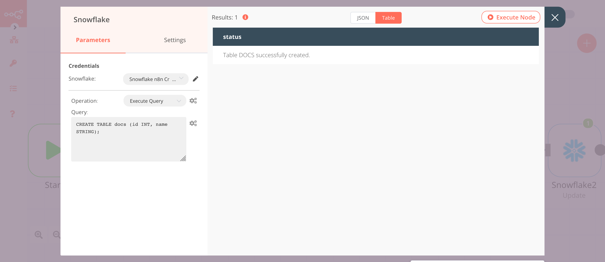

# Snowflake

[Snowflake](https://snowflake.com) is a cloud data platform that provides a data warehouse-as-a-service designed for the cloud.

::: tip 🔑 Credentials
You can find authentication information for this node [here](../../../credentials/Snowflake/README.md).
:::

## Basic Operations

- Execute an SQL query
- Insert rows in a database
- Update rows in a database

## Example Usage

This workflow allows you to create a table, insert and update data in the table. You can also find the [workflow](https://n8n.io/workflows/824) on n8n.io. This example usage workflow would use the following nodes.
- [Start](../../core-nodes/Start/README.md)
- [Set](../../core-nodes/Set/README.md)
- [Snowflake]()

The final workflow should look like the following image.

### 1. Start node

The start node exists by default when you create a new workflow.

### 2. Snowflake node (Execute Query)

This node will create a table named `docs` with the fields `id` and `name`.

1. First of all, you'll have to enter credentials for the Snowflake node. You can find out how to do that [here](../../../credentials/Snowflake/README.md).
2. Select 'Execute Query' from the ***Operation*** dropdown list.
3. Enter the following SQL query in the ***Query*** field: `CREATE TABLE docs (id INT, name STRING);`.
4. Click on ***Execute Node*** to run the node.

In the screenshot below, you will notice that the node creates a table named `docs` in Snowflake.

### 3. Set node

We will use the Set node to set the values for the name and id fields for a new record.
::: v-pre
1. Click on the ***Add Value*** button and select 'Number' from the dropdown list.
2. Enter `id` in the ***Name*** field.
3. Enter an id in the ***Value*** field.
3. Click on the ***Add Value*** button and select 'String' from the dropdown list.
4. Enter `name` in the ***Name*** field.
5. Enter the value for the name in the ***Value*** field.
6. Toggle ***Keep Only Set*** to `true`. We set this option to true to ensure that only the data that we have set in this node get passed on to the next nodes in the workflow.
7. Click on ***Execute Node*** to run the node.
:::
In the screenshot below, you will notice that the node sets the value for `id` and `name`.

### 4. Snowflake1 node (Insert)

This node will insert the data that we set in the previous node into the `docs` table in Snowflake.
::: v-pre
1. Select the credentials that you entered in the previous Snowflake node.
2. Enter `docs` in the ***Table*** field.
3. Enter `id, name` in the ***Columns*** field.
4. Click on ***Execute Node*** to run the node.
:::
In the screenshot below, you will notice that the node inserts the data in the table that we created using the Snowflake node.

### 5. Set1 node

We will use the Set node to ensure that only the data that we set in this node gets passed on to the next nodes in the workflow. We will set the value of `name` in this node.
::: v-pre
1. Click on the ***Add Value*** button and select 'Number' from the dropdown list.
2. Enter `id` in the ***Name*** field.
3. Enter `1` in the ***Value*** field.
4. Click on the ***Add Value*** button and select 'String' from the dropdown list.
5. Enter `name` in the ***Name*** field.
6. Enter `nodemation` in the ***Value*** field.
7. Toggle ***Keep Only Set*** to `true`. We set this option to true to ensure that only the data that we have set in this node get passed on to the next nodes in the workflow.
8. Click on ***Execute Node*** to run the node.
:::
In the screenshot below, you will notice that the node sets the value of `name`. This value is passed to the next node in the workflow.

### 6. Snowflake2 node (Update)

This node will update the value of the `name` field for the id `1`.
::: v-pre
1. Select the credentials that you entered in the previous Snowflake node.
2. Select 'Update' from the ***Operation*** dropdown list.
3. Click on the gears icon next to the ***Table*** field and click on ***Add Expression***.
4. Select the following in the ***Variable Selector*** section: Nodes > Snowflake1 > Parameters > table. You can also add the following expression: `{{$node["Snowflake1"].parameter["table"]}}`.
4. Enter `name` in the ***Columns*** field.
5. Click on ***Execute Node*** to run the node.
:::
In the screenshot below, you will notice that the node updates the value of the name field for the record with id `1`.

