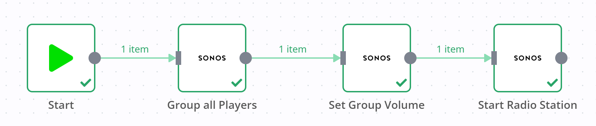

# Sonos

[Sonos](https://www.sonos.com/) is a line of smart speakers that can be controlled wirelessly.

::: tip 🔑 Credentials
You can find authentication information for this node [here](../../../credentials/Sonos/README.md).
:::

## Basic Operations

<Resource node="n8n-nodes-base.sonos" />

## Example Usage

This workflow allows you to group all players in your household, set a group volume and then play an item from your sonos favorites. You can also find the [workflow](https://n8n.io/workflows/666) on n8n.io. This example usage workflow would use the following nodes.
- [Start](../../core-nodes/Start/README.md)
- [Sonos]()

The final workflow should look like the following image.

### 1. Start node

The start node exists by default when you create a new workflow.

### 2. Sonos (Group All Players)

1. First of all, you'll have to enter credentials for the Sonos node. You can find out how to do that [here](../../../credentials/Sonos/README.md).
2. Select your household from the ***Household*** dropdown list.
3. Click on ***Action*** and select 'Group All Players' from the dropdown list.
4. Click on ***Execute Node*** to run the node.

### 3. Sonos (Set Group Volume)

1. First of all, you'll have to enter credentials for the Sonos node. You can find out how to do that [here](../../../credentials/Sonos/README.md).
2. Select your household from the ***Household*** dropdown list.
3. Click on ***Action*** and select 'Set Group Volume' from the dropdown list.
4. Specify a volume on a scale from 0 to 100 in the ***Volume*** field.
4. Click on ***Execute Node*** to run the node.

### 4. Sonos (Play Favorite)

1. First of all, you'll have to enter credentials for the Sonos node. You can find out how to do that [here](../../../credentials/Sonos/README.md).
2. Select your household from the ***Household*** dropdown list.
3. Click on ***Action*** and select 'Play Favorite' from the dropdown list.
3. Click on ***Favorite*** and select one of your favorites from the dropdown list.
4. Click on ***Execute Node*** to run the node.
