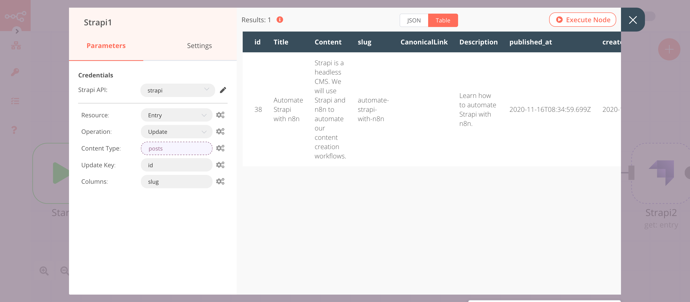

# Strapi

[Strapi](https://www.strapi.io/)  is an open-source Headless CMS that gives developers the freedom to choose their tools and frameworks while also allowing editors to easily manage and distribute their content.

::: tip 🔑 Credentials
You can find authentication information for this node [here](../../../credentials/Strapi/README.md).
:::

## Basic Operations

::: details Entry
- Create an entry
- Delete an entry
- Get an entry
- Get all entries
- Update an entry
:::

## Example Usage

This workflow allows you to create, update, and get an entry in Strapi. You can also find the [workflow](https://n8n.io/workflows/779) on n8n.io. This example usage workflow would use the following nodes.
- [Start](../../core-nodes/Start/README.md)
- [Set](../../core-nodes/Set/README.md)
- [Strapi]()

The final workflow should look like the following image.

### 1. Start node

The start node exists by default when you create a new workflow.

### 2. Set node

We will use the Set node to set the title, content, and description for an entry of the content type `Post`. If you have a different content type in Strapi, set the values accordingly.

1. Click on ***Add Value*** and select 'String' from the dropdown list.
2. Enter `Title` in the ***Name*** field.
3. Enter `Automate Strapi with n8n` in the ***Value*** field.
4. Click on ***Add Value*** and select 'String' from the dropdown list.
5. Enter `Content` in the ***Name*** field.
6. Enter `Strapi is a headless CMS. We will use Strapi and n8n to automate our content creation workflows.` in the ***Value*** field.
7. Click on ***Add Value*** and select 'String' from the dropdown list.
8. Enter `Description` in the ***Name*** field.
9. Enter `Learn how to automate Strapi with n8n.` in the ***Value*** field.
10. Click on ***Execute Node*** to run the node.

In the screenshot below, you will notice that node sets the value for title, content, and description.

### 2. Strapi node (create: entry)

This node will create an entry for the content type `Post`. If you have a different content type, use that content type instead.

1. First of all, you'll have to enter credentials for the Strapi node. You can find out how to do that [here](../../../credentials/Strapi/README.md).
2. Select 'Create' from the ***Operation*** dropdown list.
3. Enter `posts` in the ***Content Type*** field.
4. Enter `Title, Content, Description` in the ***Columns*** field. If you want to add data for other columns, enter those column names.
5. Click on ***Execute Node*** to run the node.

In the screenshot below, you will notice that the node creates a new entry in Strapi using the information from the previous node.

### 3. Set1 node

We will use the Set node to ensure that only the data that we set in this node gets passed on to the next nodes in the workflow. We will set the value of `id` and `slug` in this node.
::: v-pre
1. Click on ***Add Value*** and select 'String' from the dropdown list.
2. Enter `id` in the ***Name*** field.
3. Click on the gears icon next to the ***Value*** field and click on ***Add Expression***.
4. Select the following in the ***Variable Selector*** section: Nodes > Strapi > Output Data > JSON > id. You can also add the following expression: `{{$node["Strapi"].json["id"]}}`.
5. Click on ***Add Value*** and select 'String' from the dropdown list.
6. Enter `slug` in the ***Name*** field.
7. Enter `automate-strapi-with-n8n` in the ***Value*** field.
8. Toggle ***Keep Only Set*** to `true`. We set this option to true to ensure that only the data that we have set in this node get passed on to the next nodes in the workflow.
9. Click on ***Execute Node*** to run the node.

In the screenshot below, you will notice that the node sets the values of `id` and `slug`. These values are passed to the next node in the workflow.

### 4. Strapi1 node (update: entry)

This node will update the entry that we created using the Strapi node. We will update the slug for the new entry.
::: v-pre
1. Select the credentials that you entered in the previous node.
2. Select 'Update' from the ***Operation*** dropdown list.
3. Click on the gears icon next to the ***Content Type*** field and click on ***Add Expression***.
4. Select the following in the ***Variable Selector*** section: Nodes > Strapi > Parameters > contentType. You can also add the following expression: `{{$node["Strapi"].parameter["contentType"]}}`.
5. Enter `id` in the ***Update Key*** field.
6. Enter `slug` in the ***Columns*** field. If you want to update a different column, enter that column name instead.
7. Click on ***Execute Node*** to run the node.
:::

In the screenshot below, you will notice that the node adds a slug to the entry that we created using the Strapi node.

### 5. Strapi2 node (get: entry)

This node returns the information of the entry that we created using the Strapi node.
::: v-pre
1. Select the credentials that you entered in the previous node.
2. Click on the gears icon next to the ***Content Type*** field and click on ***Add Expression***.
3. Select the following in the ***Variable Selector*** section: Nodes > Strapi > Parameters > contentType. You can also add the following expression: `{{$node["Strapi"].parameter["contentType"]}}`.
4. Click on the gears icon next to the ***Entry ID*** field and click on ***Add Expression***.
5. Select the following in the ***Variable Selector*** section: Nodes > Strapi > Output Data > JSON > id. You can also add the following expression: `{{$node["Strapi1"].json["id"]}}`.
6. Click on ***Execute Node*** to run the node.
:::

In the screenshot below, you will notice that the node returns the information of the entry that we specified.

