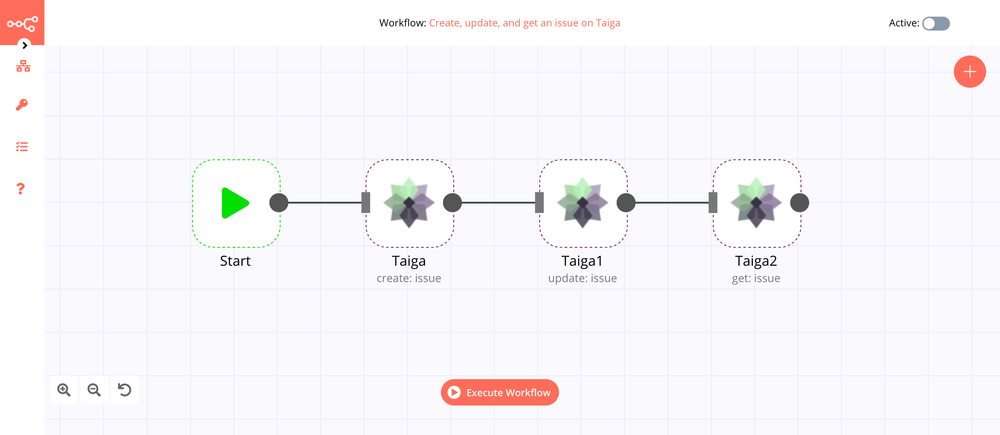
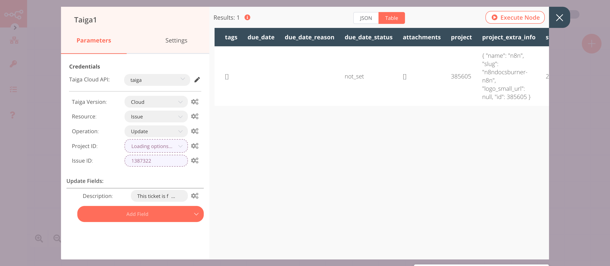
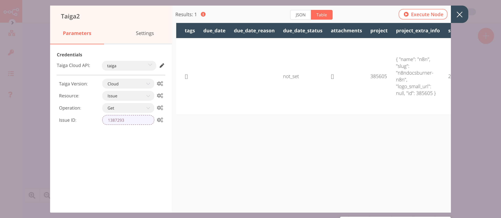

# Taiga

[Taiga](https://www.taiga.io/) is a project management platform for startups and agile developers & designers who want a simple, beautiful tool that makes work truly enjoyable.

::: tip 🔑 Credentials
You can find authentication information for this node [here](../../../credentials/Taiga/README.md).
:::

## Basic Operations

- Issue
    - Create an issue
    - Delete an issue
    - Get an issue
    - Get all issues
    - Update an issue

## Example Usage

This workflow allows you to create, update, and get an issue on Taiga. You can also find the [workflow](https://n8n.io/workflows/685) on n8n.io. This example usage workflow would use the following nodes.
- [Start](../../core-nodes/Start/README.md)
- [Taiga]()

The final workflow should look like the following image.

### 1. Start node

The start node exists by default when you create a new workflow.

### 2. Taiga node (create: issue)

1. First of all, you'll have to enter credentials for the Taiga node. You can find out how to do that [here](../../../credentials/Taiga/README.md).
2. Select the ***Project ID*** from the dropdown list.
3. Enter the subject in the ***Subject*** field.
4. Click on ***Execute Node*** to run the node.

::: v-pre
### 3. Taiga1 node (update: issue)

1. Select the credentials that you entered in the previous node.
2. Select 'Update' from the ***Operation*** dropdown list.
3. Select the ***Project ID*** from the dropdown list.
4. Click on the gears icon next to the ***Issue ID*** field and click on ***Add Expression***.
5. Select the following in the ***Variable Selector*** section: Nodes > Taiga > Output Data > JSON > id. You can also add the following expression: `{{$node["Taiga"].json["id"]}}`.
6. Click on the ***Add Field*** button and select 'Description' from the dropdown list.
7. Enter the description in the ***Description*** field.
8. Click on ***Execute Node*** to run the node.
:::

::: v-pre
### 4. Taiga2 node (get: issue)

1. Select the credentials that you entered in the previous node.
2. Select 'Get' from the ***Operation*** dropdown list.
3. Click on the gears icon next to the ***Incident ID*** field and click on ***Add Expression***.
4. Select the following in the ***Variable Selector*** section: Nodes > Taiga > Output Data > JSON > id. You can also add the following expression: `{{$node["Taiga"].json["id"]}}`.
5. Click on ***Execute Node*** to run the node.
:::

