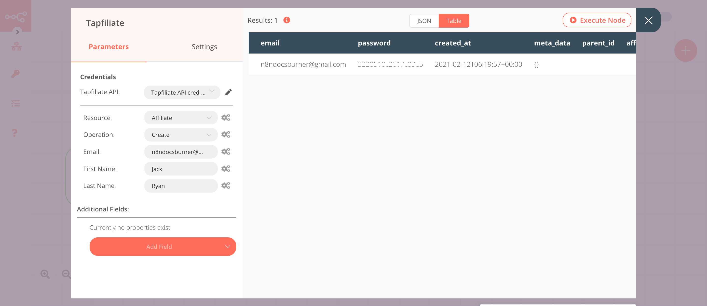

# Tapfiliate

[Tapfiliate](https://tapfiliate.com) allows you to create, track, and grow your affiliate marketing programs.

::: tip 🔑 Credentials
You can find authentication information for this node [here](../../../credentials/Tapfiliate/README.md).
:::

## Basic Operations

::: details Affiliate
- Create an affiliate
- Delete an affiliate
- Get an affiliate by ID
- Get all affiliates
:::

::: details Affiliate Metadata
- Add metadata to an affiliate
- Remove metadata from an affiliate
- Update an affiliate's metadata
:::

::: details Program Affiliate
- Add an affiliate to a program
- Approve an affiliate for a program
- Disapprove an affiliate
- Get an affiliate in a program
- Get all affiliates in a program
:::

## Example Usage

This workflow allows you to create an affiliate, add metadata, and add the affiliate to a program. You can also find the [workflow](https://n8n.io/workflows/936) on n8n.io. This example usage workflow uses the following nodes.
- [Start](../../core-nodes/Start/README.md)
- [Tapfiliate]()

The final workflow should look like the following image.

### 1. Start node

The Start node exists by default when you create a new workflow.

### 2. Tapfiliate node (create:affiliate)

This node will create an affiliate in Tapfiliate.

1. First of all, you'll have to enter credentials for the Tapfiliate node. You can find out how to do that [here](../../../credentials/Tapfiliate/README.md).
2. Enter an email address in the ***Email*** field.
3. Enter the first name of the affiliate in the ***First Name*** field.
4. Enter the last name of the affiliate in the ***Last Name*** field.
5. Click on ***Execute Node*** to run the node.

In the screenshot below, you will notice that the node creates an affiliate in Tapfiliate.

### 3. Tapfiliate1 node (add:affiliateMetadata)

This node will add metadata to the affiliate that we created in the previous node.

::: v-pre
1. Select the credentials that you entered in the previous node.
2. Select 'Affiliate Metadata' from the ***Resource*** dropdown list.
3. Select 'Add' from the ***Operation*** dropdown list.
4. Click on the gears icon next to the ***Affiliate ID*** field and click on ***Add Expression***.
5. Select the following in the ***Variable Selector*** section: Current Node > Input Data > JSON > id. You can also add the following expression: `{{$json["id"]}}`.
6. Click on the ***Add Metadata*** button.
7. Enter `tag` in the ***Key*** field.
8. Enter `n8n` in the ***Value*** field.
9. Click on ***Execute Node*** to run the node.
:::
In the screenshot below, you will notice that the node adds the metadata to the affiliate that we created in the previous node.

### 4. Tapfiliate2 node (get:contact)

This node will add the affiliate that we created in the Tapfiliate node to an affiliate program.
::: v-pre
1. Select the credentials that you entered in the previous node.
2. Select 'Program Affiliate' from the ***Resource*** dropdown list.
3. Select 'Add' from the ***Operation*** dropdown list.
4. Select a program from the ***Program ID*** dropdown list.
5. Click on the gears icon next to the ***Affiliate ID*** field and click on ***Add Expression***.
6. Select the following in the ***Variable Selector*** section: Nodes > Tapfiliate > Output Data > JSON > id. You can also add the following expression: `{{$node["Tapfiliate"].json["id"]}}`.
7. Click on ***Execute Node*** to run the node.
:::

In the screenshot below, you will notice that the node adds the affiliate to a program.

