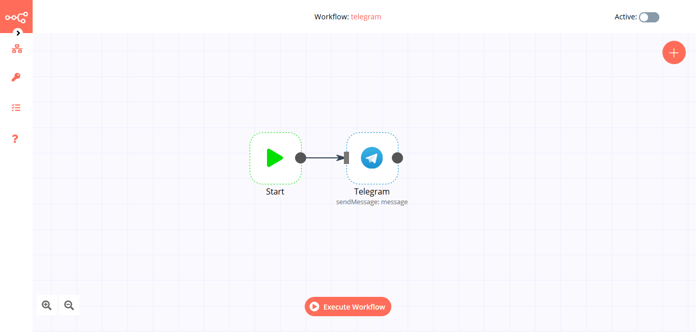

# Telegram

[Telegram](https://telegram.org) is a cloud-based instant messaging and voice-over-IP service.

::: tip 🔑 Credentials
You can find authentication information for this node [here](../../../credentials/Telegram/README.md).
:::

## Basic Operations

::: details Chat
- Get up to date information about a chat
- Leave a group, supergroup or channel
- Get the member of a chat
- Set the description of a chat
- Set the title of a chat
:::

::: details Callback
- Send an answer to a callback query sent from the inline keyboard
:::

::: details Message
- Edit a text message
- Send an audio file
- Send a chat action
- Send a document
- Send a text message
- Send a group of photos or videos to an album
- Send a photo
- Send a sticker
- Send a video
:::

## Example Usage

This workflow allows you to send a cocktail recipe to a specified chat ID every day via a Telegram bot. You can also find the [workflow](https://n8n.io/workflows/781) on n8n.io. This example usage workflow uses the following nodes.
- [Cron](../../core-nodes/Cron/README.md)
- [HTTP Request](../../core-nodes/HTTPRequest/README.md)
- [Telegram]()

The final workflow should look like the following image.

### 1. Cron node

The Cron node will trigger the workflow daily at 8 PM.

1. Click on ***Add Cron Time***.
2. Set hours to `20` in the ***Hour*** field.
3. Click on ***Execute Node*** to run the node.

In the screenshot below, you will notice that the Cron node is configured to trigger the workflow every day at 8 PM.

### 2. HTTP Request node (GET)

This node will make a GET request to the API `https://www.thecocktaildb.com/api/json/v1/1/random.php` to fetch a random cocktail. This information gets passed on to the next node in the workflow.

1. Enter `https://www.thecocktaildb.com/api/json/v1/1/random.php` in the ***URL*** field.
2. Click on ***Execute Node*** to run the node.

In the screenshot below, you will notice that the node makes a GET request to the API and returns information about a random cocktail.

### 3. Telegram node (sendPhoto: message)

This node will send a message on Telegram with an image and the recipe of the cocktail that we got from the previous node.

1. First of all, you'll have to enter credentials for the Telegram node. You can find out how to do that [here](../../../credentials/Telegram/README.md).
::: v-pre
2. Select 'Send Photo' from the ***Operation*** dropdown list.
3. Enter the target chat ID in the ***Chat ID*** field. Refer to the [FAQs](#how-do-i-get-a-chat-id) to learn how to get the chat ID.
4. Click on the gears icon next to the ***Photo*** field and click on ***Add Expression***.
5. Select the following in the ***Variable Selector*** section: Nodes > HTTP Request > Output Data > JSON > drinks > [item: 0] > strDrinkThumb. You can also add the following expression: `{{$node["HTTP Request"].json["drinks"][0]["strDrinkThumb"]}}`.
6. Click on ***Add Field*** and select 'Caption' from the dropdown list.
7. Click on the gears icon next to the ***Caption*** field and click on ***Add Expression***.
8. Select the following in the ***Variable Selector*** section: Nodes > HTTP Request > Output Data > JSON > drinks > [item: 0] > strInstructions. You can also add the following expression: `{{$node["HTTP Request"].json["drinks"][0]["strInstructions"]}}`.
9. Click on ***Execute Node*** to run the node.
:::
In the screenshot below, you will notice that the node sends a message on Telegram with an image and the recipe of the cocktail.

::: tip 💡 Activate workflow for production
This example workflow uses the Cron node, which is a Trigger node. You'll need to save the workflow and then click on the Activate toggle on the top right of the screen to activate the workflow. Your workflow will then be triggered as specified by the settings in the Cron node.
:::

## FAQs

### How can I send more than 30 messages per second?

The Telegram API has a [limitation](https://core.telegram.org/bots/faq#broadcasting-to-users) of sending only 30 messages per second. Follow the steps mentioned below to send more than 30 messages:
1. Split In Batches node: Use the [Split in Batches](../../core-nodes/SplitInBatches/README.md) node to get at most 30 chat IDs from your database.
2. Telegram node: Connect the Telegram node with the Split In Batches node. Use the ***Expression Editor*** to select the Chat IDs from the Split in Batches node.
3. Function node: Connect the [Function](../../core-nodes/Function/README.md) node with the Telegram node. Use the Function node to wait for a few seconds before fetching the next batch of chat IDs. Connect this node with the Split In Batches node.

You can also use this [workflow](https://n8n.io/workflows/772).

### How do I add a bot to a Telegram channel?

1. In the Telegram app, access the target channel and tap on the channel name.
2. Make sure that the channel name is labeled as "public channel".
3. Tap on ***Administrators*** and then on ***Add Admin***.
4. Search for the username of the bot and select it.
5. Tap on the checkmark on the top-right corner to add the bot to the channel.

### How do I get the Chat ID?

There are two ways to get the Chat ID in Telegram.

- Using the [Telegram Trigger](../../trigger-nodes/TelegramTrigger/README.md) node: On successful execution, the Telegram Trigger node returns a Chat ID. You can use the Telegram Trigger node in your workflow to get a Chat ID.
- Using the `@RawDataBot`: The `@RawDataBot` returns the raw data of the chat with a Chat ID. Invite the `@RawDataBot` to your channel/group, and upon joining, it will output a Chat ID along with other information. Be sure to remove the `@RawDataBot` from your group/channel afterwards.

## Further Reading

- [Automatically Adding Expense Receipts to Google Sheets with Telegram, Mindee, Twilio, and n8n 🧾](https://medium.com/n8n-io/automatically-adding-expense-receipts-to-google-sheets-with-telegram-mindee-twilio-and-n8n-c47eb2f8d7a5)
- [Creating Telegram Bots with n8n, a No-Code Platform](https://medium.com/n8n-io/creating-telegram-bots-with-n8n-a-no-code-platform-fdf1f0928da7)
